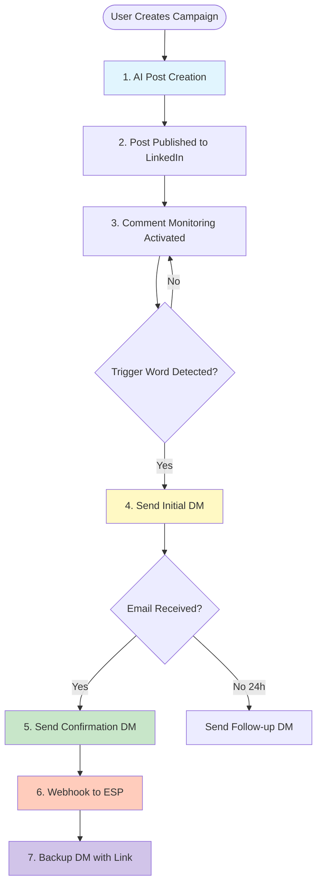

# Comprehensive Lead Flow Documentation

## Executive Summary

The Bravo revOS lead generation system orchestrates a sophisticated 7-step flow from post creation to lead magnet delivery, leveraging AI-powered copywriting, voice personalization, and multi-channel delivery to maximize conversion rates.

## Complete Flow Diagram



## Detailed Step-by-Step Flow

### Step 1: AI-Powered Post Creation

**Purpose**: Generate engaging LinkedIn posts that drive comments

**Process**:
1. User initiates campaign with lead magnet details
2. Copywriting skill generates professional copy using AIDA framework
3. Voice cartridge transforms to user's authentic voice
4. Optional human review/editing
5. Post includes clear CTA with trigger word

**Example Flow**:
```javascript
// User provides campaign brief
const campaign = {
  leadMagnet: {
    title: "10x Leadership Framework",
    value: "Scale teams from 10 to 100+ employees",
    triggerWord: "SCALE"
  }
};

// AI generates post
const post = await generatePost(campaign);
// Output:
// "After coaching 500+ CEOs, I discovered something shocking...
//  [engaging content about leadership challenges]
//  Comment 'SCALE' below for my free framework 👇"
```

**Key Components**:
- Copywriting skill (AIDA framework)
- Voice cartridge personalization
- AgentKit orchestration
- Mem0 learning from successful posts

---

### Step 2: Post Publication

**Purpose**: Publish optimized content to LinkedIn

**Process**:
1. Post scheduled via BullMQ queue
2. Published through Unipile API
3. Post URL stored for monitoring
4. Engagement tracking initiated

**Technical Details**:
```typescript
await unipile.createPost({
  accountId: user.linkedinAccountId,
  content: post.content,
  media: post.media, // optional images/video
  visibility: 'public'
});
```

**Rate Limits**:
- Max 25 posts/day per account
- Min 30 minutes between posts
- Random scheduling for natural appearance

---

### Step 3: Comment Monitoring

**Purpose**: Detect trigger words in comments

**Critical Note**: Unipile has NO webhook for comments - must poll

**Process**:
1. Poll every 15-30 minutes (randomized)
2. Fetch new comments since last check
3. Search for trigger word (case-insensitive)
4. Queue DMs for matches

**Implementation**:
```javascript
// Polling service (runs every 15-30 min)
async function pollComments() {
  const campaigns = await getActiveCampaigns();

  for (const campaign of campaigns) {
    const lastPoll = campaign.lastPolledAt || new Date(0);
    const comments = await unipile.getPostComments({
      postId: campaign.postId,
      since: lastPoll
    });

    for (const comment of comments) {
      if (comment.text.toLowerCase().includes(campaign.triggerWord.toLowerCase())) {
        await queueDM(comment, campaign);
      }
    }

    await updateLastPolled(campaign.id);
  }
}
```

**Monitoring Rules**:
- Randomize polling intervals (avoid detection)
- Track lastPolledAt per campaign
- Handle rate limits gracefully
- Log all detected triggers

---

### Step 4: Initial DM - Request Email

**Purpose**: Request email address from interested lead

**Trigger**: Comment with trigger word detected

**Process**:
1. Wait 2-15 minutes (random delay)
2. Generate personalized DM via copywriting skill
3. Apply voice cartridge transformation
4. Send via Unipile API
5. Track in dm_sequences table

**Message Generation**:
```javascript
const message = await generateDM({
  type: 'initial_request',
  recipientName: comment.authorFirstName,
  leadMagnetName: campaign.leadMagnet.title,
  triggerWord: comment.text
});

// Example output (after voice filter):
// "Hey John! Saw your 'SCALE' comment - love it!
//  Ready to grab that 10x Leadership Framework?
//  Drop your email and I'll send it right over 📧"
```

**Rate Limiting**:
- Max 50 DMs/day per account
- Min 2 minutes between DMs
- Exponential backoff on failures

---

### Step 5: Confirmation DM

**Purpose**: Confirm email receipt and set delivery expectation

**Trigger**: Email extracted from DM reply

**Process**:
1. Extract email using regex + GPT validation
2. Update lead status to 'email_captured'
3. Send confirmation DM immediately
4. Include delivery time estimate

**Email Extraction**:
```javascript
async function extractEmail(dmReply: string): Promise<string> {
  // Try regex first
  const emailRegex = /([a-zA-Z0-9._%+-]+@[a-zA-Z0-9.-]+\.[a-zA-Z]{2,})/g;
  const matches = dmReply.match(emailRegex);

  if (matches.length === 0) {
    // Use GPT-4 for complex extraction
    const extracted = await gpt4.extract({
      text: dmReply,
      type: 'email'
    });

    if (!extracted) {
      // Request clarification
      await sendDM("I didn't catch your email. Could you send it again?");
      return null;
    }
  }

  return validateEmail(matches[0]);
}
```

**Confirmation Message**:
```
"Perfect! Sending the 10x Leadership Framework to john@example.com now.

Check your inbox (and spam) in the next few minutes.

If you don't see it within 5 minutes, I'll send you a direct download link right here."
```

---

### Step 6: Webhook to Client's ESP

**Purpose**: Deliver lead data to client's email system

**Trigger**: Email successfully captured

**Process**:
1. Construct webhook payload with lead data
2. Add lead magnet download URL
3. POST to configured webhook endpoint
4. Handle retries with exponential backoff
5. Track delivery status

**Webhook Payload**:
```json
{
  "email": "john@example.com",
  "first_name": "John",
  "last_name": "Doe",
  "linkedin_url": "https://linkedin.com/in/johndoe",
  "lead_magnet_name": "10x Leadership Framework",
  "lead_magnet_url": "https://storage.supabase.co/signed/abc123.pdf",
  "campaign_id": "camp_123",
  "campaign_name": "Q4 Leadership Campaign",
  "captured_at": "2024-01-15T10:30:00Z",
  "source": "linkedin_comment",
  "metadata": {
    "post_url": "https://linkedin.com/posts/...",
    "trigger_word": "SCALE"
  }
}
```

**ESP Integration**:
- Client configures webhook URL (Zapier, Make, direct API)
- ESP sends email with lead magnet
- We don't send emails directly (client handles)

---

### Step 7: Backup DM with Direct Link

**Purpose**: Ensure delivery with direct download link

**Trigger**: 5 minutes after confirmation DM

**Process**:
1. Generate signed URL from Supabase Storage
2. Optional: Shorten URL with bit.ly
3. Send DM with direct link
4. Track link clicks and downloads

**Backup Message**:
```
"Hey John!

Here's that backup link I promised 🎁

10x Leadership Framework: https://bit.ly/abc123

(Link expires in 24 hours so grab it now!)

Should also be in your email, but wanted to make sure you got it 💪"
```

**Link Management**:
```javascript
async function generateSecureLink(leadMagnetId: string): Promise<string> {
  // Generate 24-hour signed URL
  const { data } = await supabase.storage
    .from('lead-magnets')
    .createSignedUrl(leadMagnetId, 86400);

  // Add tracking parameters
  const url = new URL(data.signedUrl);
  url.searchParams.append('source', 'backup_dm');
  url.searchParams.append('lid', leadId);

  // Optional: Shorten
  if (config.useLinkShortener) {
    return await bitly.shorten(url.toString());
  }

  return url.toString();
}
```

---

## Critical Implementation Details

### Unipile API Integration

**What Unipile Provides**:
- ✅ Post creation and management
- ✅ DM sending and receiving
- ✅ Profile data access
- ✅ Webhook for new DM replies
- ❌ NO webhook for comments (must poll)
- ❌ NO direct comment replies (use DM only)

**Authentication**:
```javascript
// Unipile hosted auth (username/password)
const session = await unipile.auth({
  provider: 'linkedin',
  username: user.linkedinEmail,
  password: user.linkedinPassword // encrypted
});

// Store session (expires in 90 days)
await storeSession(session, user.id);
```

---

### Skills and Voice Integration

**Every message flows through**:
1. **Copywriting Skill**: Professional, conversion-optimized copy
2. **Voice Cartridge**: User's authentic voice and tone

**Example Transformation**:
```javascript
// Step 1: Copywriting generates
const professional = "I noticed you commented 'SCALE' on my leadership post...";

// Step 2: Voice transforms to casual
const personalized = "Hey! Saw your SCALE comment - love it! 🎯";

// Step 3: Final output maintains effectiveness + authenticity
```

---

### Engagement Pod Automation

**Critical Understanding**: EVERYONE engages with EVERYTHING

**Process**:
1. When any pod member posts
2. ALL other members (8+ minimum) automatically:
   - Like within 30 minutes (algorithm window)
   - Comment within 1-3 hours
   - Instant repost (NOT "repost with thoughts")
3. No selection or rotation - 100% participation

**Implementation**:
```javascript
async function onPodMemberPost(post: LinkedInPost, podId: string) {
  const members = await getPodMembers(podId);
  const others = members.filter(m => m.id !== post.authorId);

  for (const member of others) {
    // Queue engagement actions with delays
    await queueLike(member, post, random(1, 30) * MINUTE);
    await queueComment(member, post, random(30, 180) * MINUTE);
    await queueRepost(member, post, random(5, 60) * MINUTE);
  }
}
```

---

### Rate Limits and Safety

**LinkedIn/Unipile Limits**:
```javascript
const rateLimits = {
  posts: { max: 25, per: 'day' },
  dms: { max: 50, per: 'day' },
  comments: { max: 100, per: 'day' },
  likes: { max: 300, per: 'day' },
  connections: { max: 100, per: 'week' }
};
```

**Safety Measures**:
- Random delays between actions
- Exponential backoff on failures
- Daily/hourly limit tracking
- Account health monitoring

---

## Configuration and Toggles

### Campaign Settings

```typescript
interface CampaignConfig {
  // Content Generation
  contentGeneration: {
    mode: 'ai' | 'human' | 'hybrid';
    copywritingSkill: boolean; // Always true
    voiceCartridge: string; // Required
  };

  // Lead Capture
  leadCapture: {
    triggerWord: string;
    caseSensitive: boolean;
    pollingIntervalMinutes: number; // 15-30
  };

  // DM Sequence
  dmSequence: {
    step1Delay: [number, number]; // [min, max] minutes
    step2Immediate: boolean;
    step3Enabled: boolean;
    step3DelayMinutes: number; // Default: 5
  };

  // Delivery
  delivery: {
    webhookUrl: string;
    espType: 'zapier' | 'make' | 'convertkit' | 'custom';
    backupDMEnabled: boolean;
    linkExpirationHours: number;
  };

  // Engagement Pods
  pods: {
    enabled: boolean;
    podId: string;
    autoEngage: boolean; // Always true when enabled
  };
}
```

---

## Testing and Validation

### End-to-End Test Flow

```javascript
describe('Lead Generation Flow', () => {
  test('Complete flow from post to delivery', async () => {
    // 1. Create post with trigger word
    const post = await createPost({
      content: 'Test post. Comment TEST below',
      triggerWord: 'TEST'
    });

    // 2. Simulate comment
    const comment = await simulateComment(post.id, 'TEST');

    // 3. Wait for DM
    const dm = await waitForDM(comment.authorId, 30000);
    expect(dm.content).toContain('email');

    // 4. Reply with email
    const reply = await replyToDM(dm.id, 'test@example.com');

    // 5. Verify confirmation DM
    const confirmation = await waitForDM(comment.authorId, 5000);
    expect(confirmation.content).toContain('Check your inbox');

    // 6. Verify webhook sent
    const webhook = await getWebhookDelivery(comment.authorId);
    expect(webhook.status).toBe('success');

    // 7. Verify backup DM (after 5 min)
    await sleep(5 * 60 * 1000);
    const backup = await getLatestDM(comment.authorId);
    expect(backup.content).toContain('https://');
  });
});
```

---

## Monitoring and Analytics

### Key Metrics

```typescript
interface LeadFlowMetrics {
  posts: {
    created: number;
    impressions: number;
    comments: number;
    triggerRate: number; // % comments with trigger word
  };

  dms: {
    sent: number;
    delivered: number;
    replied: number;
    replyRate: number;
    avgResponseTime: number;
  };

  leads: {
    captured: number;
    captureRate: number; // % of triggers → emails
    webhooksDelivered: number;
    downloadsCompleted: number;
  };

  pods: {
    postsEngaged: number;
    avgEngagementTime: number;
    participationRate: number;
  };
}
```

### Real-Time Dashboard

```jsx
function LeadFlowDashboard() {
  return (
    <div className="grid grid-cols-3 gap-4">
      <MetricCard
        title="Trigger Comments"
        value={metrics.posts.comments}
        subtext={`${metrics.posts.triggerRate}% trigger rate`}
      />
      <MetricCard
        title="Emails Captured"
        value={metrics.leads.captured}
        subtext={`${metrics.leads.captureRate}% capture rate`}
      />
      <MetricCard
        title="Lead Magnets Delivered"
        value={metrics.leads.downloadsCompleted}
        subtext="Via webhook + backup DM"
      />
    </div>
  );
}
```

---

## Database Schema Overview

### Core Tables

```sql
-- Campaigns (lead magnet offers)
campaigns

-- LinkedIn posts
posts

-- Comments with trigger words
comments

-- DM sequence tracking
dm_sequences

-- Captured leads
leads

-- Webhook deliveries
webhook_deliveries

-- Engagement pods
pods, pod_members, pod_activities

-- Lead magnet storage
lead_magnets

-- Voice cartridges
cartridges

-- Skills configuration
campaign_skills
```

---

## Error Recovery

### Common Failure Scenarios

1. **Comment Polling Fails**
   - Continue with next poll cycle
   - Alert if 3+ consecutive failures

2. **DM Send Fails**
   - Retry with exponential backoff
   - Use alternate account if available

3. **Email Extraction Fails**
   - Request clarification via DM
   - Max 2 clarification attempts

4. **Webhook Delivery Fails**
   - Retry 3 times with backoff
   - Log failure, continue with backup DM

5. **Backup DM Fails**
   - Log critical error
   - Add to manual intervention queue

---

## Summary

The comprehensive lead flow ensures maximum conversion through:

1. **AI-Optimized Content**: Copywriting skill + voice cartridge
2. **Automated Detection**: Comment polling for trigger words
3. **Personalized Outreach**: 3-step DM sequence
4. **Multi-Channel Delivery**: Webhook to ESP + backup DM
5. **Pod Amplification**: Everyone engages with everything
6. **Intelligent Recovery**: Graceful handling of all failure modes
7. **Continuous Learning**: Mem0 improves over time

This system delivers a seamless experience from initial interest to lead magnet delivery, with multiple safeguards ensuring no lead is lost.