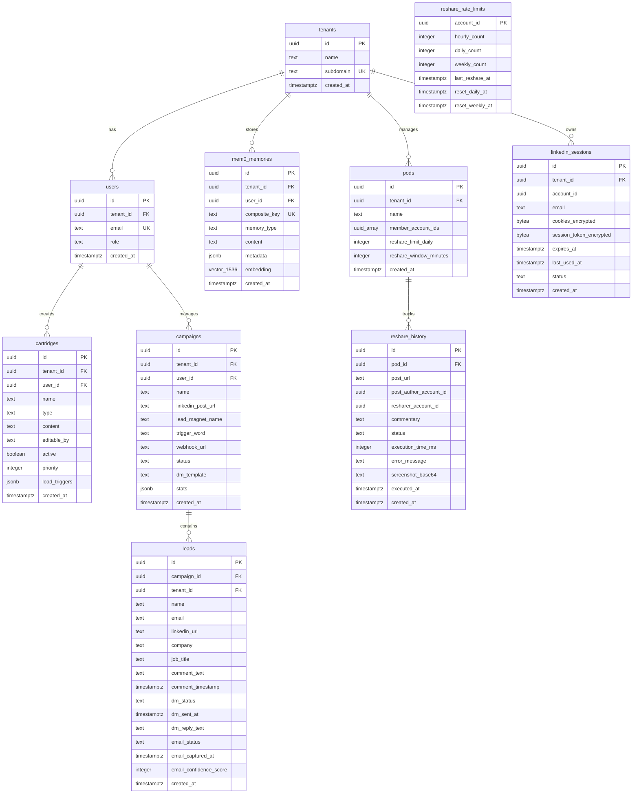

# Data Model: RevOS V1 V1 V1 - LinkedIn Growth Engine

**Date**: 2025-11-02
**Feature**: RevOS V1 V1 V1 - Lead Magnet Automation + Engagement Pod Reshare
**Database**: PostgreSQL (Supabase) with pgvector extension
**Multi-Tenancy**: Row-Level Security (RLS) policies

---

## Design Principles

1. **Multi-tenant isolation**: Every table includes `tenant_id` with RLS policies
2. **Cartridge extensibility**: Progressive disclosure for AgentKit context loading
3. **Mem0 integration**: Persistent memory with composite keys `tenantId::userId`
4. **Rate limit safety**: LinkedIn-safe limits (50 DMs/day, 20 reshares/day)
5. **Audit trails**: All tables include `created_at`, `updated_at` timestamps
6. **Encryption at rest**: LinkedIn session cookies encrypted with AES-256-GCM

---

## Entity Relationship Diagram



---

## Core Entities

### tenants

Multi-tenant container for all user data.

```sql
CREATE TABLE tenants (
  id UUID PRIMARY KEY DEFAULT gen_random_uuid(),
  name TEXT NOT NULL,
  subdomain TEXT UNIQUE, -- For white-label domains
  created_at TIMESTAMPTZ DEFAULT NOW(),
  updated_at TIMESTAMPTZ DEFAULT NOW()
);
```

### users

User accounts with role-based access control.

```sql
CREATE TABLE users (
  id UUID PRIMARY KEY DEFAULT gen_random_uuid(),
  tenant_id UUID NOT NULL REFERENCES tenants(id) ON DELETE CASCADE,
  email TEXT NOT NULL UNIQUE,
  role TEXT NOT NULL CHECK (role IN ('superadmin', 'admin', 'member')),
  created_at TIMESTAMPTZ DEFAULT NOW(),
  updated_at TIMESTAMPTZ DEFAULT NOW()
);

CREATE INDEX idx_users_tenant_id ON users(tenant_id);
CREATE INDEX idx_users_email ON users(email);
```

### cartridges

AgentKit context cartridges for progressive disclosure.

```sql
CREATE TABLE cartridges (
  id UUID PRIMARY KEY DEFAULT gen_random_uuid(),
  tenant_id UUID NOT NULL REFERENCES tenants(id) ON DELETE CASCADE,
  user_id UUID REFERENCES users(id) ON DELETE CASCADE, -- NULL for system cartridges
  name TEXT NOT NULL,
  type TEXT NOT NULL CHECK (type IN ('system', 'user', 'skill', 'preferences')),
  content TEXT NOT NULL, -- Markdown content
  editable_by TEXT NOT NULL CHECK (editable_by IN ('superadmin', 'user', 'both')),
  active BOOLEAN DEFAULT TRUE,
  priority INTEGER DEFAULT 0, -- Loading order (higher = load first)
  load_triggers JSONB, -- Keywords for lazy loading, e.g., ["linkedin", "post creation"]
  created_at TIMESTAMPTZ DEFAULT NOW(),
  updated_at TIMESTAMPTZ DEFAULT NOW()
);

CREATE INDEX idx_cartridges_tenant_id ON cartridges(tenant_id);
CREATE INDEX idx_cartridges_user_id ON cartridges(user_id);
CREATE INDEX idx_cartridges_type ON cartridges(type);
CREATE INDEX idx_cartridges_active ON cartridges(active);
```

---

## V1 Core - Lead Magnet Automation

### campaigns

LinkedIn lead magnet campaigns with configurable trigger words.

```sql
CREATE TABLE campaigns (
  id UUID PRIMARY KEY DEFAULT gen_random_uuid(),
  tenant_id UUID NOT NULL REFERENCES tenants(id) ON DELETE CASCADE,
  user_id UUID NOT NULL REFERENCES users(id) ON DELETE CASCADE,
  name TEXT NOT NULL,
  linkedin_post_url TEXT NOT NULL,
  lead_magnet_name TEXT NOT NULL,
  trigger_word TEXT NOT NULL, -- Configurable (e.g., "SWIPE", "BANANA", "YES")
  webhook_url TEXT NOT NULL, -- For email delivery to client's CRM
  status TEXT NOT NULL CHECK (status IN ('draft', 'active', 'paused', 'completed')) DEFAULT 'draft',
  dm_template TEXT, -- Personalization variables: {name}, {lead_magnet_name}
  stats JSONB DEFAULT '{"total_leads": 0, "dms_sent": 0, "emails_captured": 0}',
  created_at TIMESTAMPTZ DEFAULT NOW(),
  updated_at TIMESTAMPTZ DEFAULT NOW()
);

CREATE INDEX idx_campaigns_tenant_id ON campaigns(tenant_id);
CREATE INDEX idx_campaigns_user_id ON campaigns(user_id);
CREATE INDEX idx_campaigns_status ON campaigns(status);
```

### leads

Commenters who used the trigger word, with DM and email capture tracking.

```sql
CREATE TABLE leads (
  id UUID PRIMARY KEY DEFAULT gen_random_uuid(),
  campaign_id UUID NOT NULL REFERENCES campaigns(id) ON DELETE CASCADE,
  tenant_id UUID NOT NULL REFERENCES tenants(id) ON DELETE CASCADE,
  name TEXT,
  email TEXT,
  linkedin_url TEXT NOT NULL UNIQUE, -- Prevent duplicate leads
  company TEXT,
  job_title TEXT,
  comment_text TEXT,
  comment_timestamp TIMESTAMPTZ,
  dm_status TEXT CHECK (dm_status IN ('pending', 'sent', 'replied', 'failed')),
  dm_sent_at TIMESTAMPTZ,
  dm_reply_text TEXT,
  email_status TEXT CHECK (email_status IN ('captured', 'sent_to_webhook', 'failed')),
  email_captured_at TIMESTAMPTZ,
  email_confidence_score INTEGER CHECK (email_confidence_score BETWEEN 0 AND 100),
  created_at TIMESTAMPTZ DEFAULT NOW(),
  updated_at TIMESTAMPTZ DEFAULT NOW()
);

CREATE INDEX idx_leads_campaign_id ON leads(campaign_id);
CREATE INDEX idx_leads_tenant_id ON leads(tenant_id);
CREATE INDEX idx_leads_dm_status ON leads(dm_status);
CREATE INDEX idx_leads_email_status ON leads(email_status);
CREATE UNIQUE INDEX idx_leads_linkedin_url ON leads(linkedin_url);
```

---

## Mem0 Integration - Persistent Memory

### mem0_memories

Persistent memory for AgentKit with tenant isolation.

```sql
-- Enable pgvector extension
CREATE EXTENSION IF NOT EXISTS vector;

CREATE TABLE mem0_memories (
  id UUID PRIMARY KEY DEFAULT gen_random_uuid(),
  tenant_id UUID NOT NULL REFERENCES tenants(id) ON DELETE CASCADE,
  user_id UUID NOT NULL REFERENCES users(id) ON DELETE CASCADE,
  composite_key TEXT NOT NULL, -- Format: "tenantId::userId"
  memory_type TEXT NOT NULL CHECK (memory_type IN ('preference', 'goal', 'pattern', 'context', 'relationship')),
  content TEXT NOT NULL,
  metadata JSONB, -- Additional context (e.g., campaign_id, entity references)
  embedding vector(1536), -- OpenAI text-embedding-3-small (1536 dimensions)
  created_at TIMESTAMPTZ DEFAULT NOW(),
  updated_at TIMESTAMPTZ DEFAULT NOW()
);

CREATE INDEX idx_mem0_composite_key ON mem0_memories(composite_key);
CREATE INDEX idx_mem0_tenant_id ON mem0_memories(tenant_id);
CREATE INDEX idx_mem0_user_id ON mem0_memories(user_id);
CREATE INDEX idx_mem0_memory_type ON mem0_memories(memory_type);

-- HNSW index for fast vector similarity search (cosine distance)
CREATE INDEX idx_mem0_embedding ON mem0_memories
  USING HNSW (embedding vector_cosine_ops);
```

**Composite Key Format**: `{tenantId}::{userId}`

**Example**: `550e8400-e29b-41d4-a716-446655440000::a1b2c3d4-e5f6-7g8h-9i0j-k1l2m3n4o5p6`

---

## V1.5 Premium - Engagement Pod Reshare

### pods

Engagement pod configuration for automated resharing.

```sql
CREATE TABLE pods (
  id UUID PRIMARY KEY DEFAULT gen_random_uuid(),
  tenant_id UUID NOT NULL REFERENCES tenants(id) ON DELETE CASCADE,
  name TEXT NOT NULL,
  member_account_ids UUID[] NOT NULL, -- Array of LinkedIn session IDs
  reshare_limit_daily INTEGER DEFAULT 20, -- Max reshares/day per member
  reshare_window_minutes INTEGER DEFAULT 60, -- Spread reshares over this window
  created_at TIMESTAMPTZ DEFAULT NOW(),
  updated_at TIMESTAMPTZ DEFAULT NOW()
);

CREATE INDEX idx_pods_tenant_id ON pods(tenant_id);
```

### linkedin_sessions

Encrypted LinkedIn session storage for Playwright automation.

```sql
CREATE TABLE linkedin_sessions (
  id UUID PRIMARY KEY DEFAULT gen_random_uuid(),
  tenant_id UUID NOT NULL REFERENCES tenants(id) ON DELETE CASCADE,
  account_id UUID NOT NULL, -- Links to external account system
  email TEXT NOT NULL,
  cookies_encrypted BYTEA NOT NULL, -- AES-256-GCM encrypted cookies
  session_token_encrypted BYTEA NOT NULL, -- AES-256-GCM encrypted session token
  expires_at TIMESTAMPTZ NOT NULL,
  last_used_at TIMESTAMPTZ,
  status TEXT NOT NULL CHECK (status IN ('active', 'expired')) DEFAULT 'active',
  created_at TIMESTAMPTZ DEFAULT NOW(),
  updated_at TIMESTAMPTZ DEFAULT NOW()
);

CREATE INDEX idx_linkedin_sessions_tenant_id ON linkedin_sessions(tenant_id);
CREATE INDEX idx_linkedin_sessions_account_id ON linkedin_sessions(account_id);
CREATE INDEX idx_linkedin_sessions_status ON linkedin_sessions(status);
CREATE INDEX idx_linkedin_sessions_expires_at ON linkedin_sessions(expires_at);
```

### reshare_history

Audit log of all reshare automation executions.

```sql
CREATE TABLE reshare_history (
  id UUID PRIMARY KEY DEFAULT gen_random_uuid(),
  pod_id UUID NOT NULL REFERENCES pods(id) ON DELETE CASCADE,
  post_url TEXT NOT NULL,
  post_author_account_id UUID NOT NULL, -- Author excluded from resharing
  resharer_account_id UUID NOT NULL,
  commentary TEXT NOT NULL, -- AI-generated unique commentary
  status TEXT NOT NULL CHECK (status IN ('queued', 'processing', 'success', 'failed')),
  execution_time_ms INTEGER, -- Playwright execution duration
  error_message TEXT,
  screenshot_base64 TEXT, -- Debug screenshot on failure
  executed_at TIMESTAMPTZ,
  created_at TIMESTAMPTZ DEFAULT NOW()
);

CREATE INDEX idx_reshare_history_pod_id ON reshare_history(pod_id);
CREATE INDEX idx_reshare_history_status ON reshare_history(status);
CREATE INDEX idx_reshare_history_resharer_account_id ON reshare_history(resharer_account_id);
CREATE INDEX idx_reshare_history_executed_at ON reshare_history(executed_at);
```

### reshare_rate_limits

Rate limit tracking per LinkedIn account for spam prevention.

```sql
CREATE TABLE reshare_rate_limits (
  account_id UUID PRIMARY KEY,
  hourly_count INTEGER DEFAULT 0,
  daily_count INTEGER DEFAULT 0,
  weekly_count INTEGER DEFAULT 0,
  last_reshare_at TIMESTAMPTZ,
  reset_daily_at TIMESTAMPTZ DEFAULT (CURRENT_DATE + INTERVAL '1 day'),
  reset_weekly_at TIMESTAMPTZ DEFAULT (DATE_TRUNC('week', CURRENT_DATE) + INTERVAL '1 week'),
  updated_at TIMESTAMPTZ DEFAULT NOW()
);

CREATE INDEX idx_reshare_rate_limits_reset_daily_at ON reshare_rate_limits(reset_daily_at);
CREATE INDEX idx_reshare_rate_limits_reset_weekly_at ON reshare_rate_limits(reset_weekly_at);
```

---

## Row-Level Security (RLS) Policies

Enable RLS on all tenant-scoped tables:

```sql
-- Enable RLS on all tables
ALTER TABLE tenants ENABLE ROW LEVEL SECURITY;
ALTER TABLE users ENABLE ROW LEVEL SECURITY;
ALTER TABLE cartridges ENABLE ROW LEVEL SECURITY;
ALTER TABLE campaigns ENABLE ROW LEVEL SECURITY;
ALTER TABLE leads ENABLE ROW LEVEL SECURITY;
ALTER TABLE mem0_memories ENABLE ROW LEVEL SECURITY;
ALTER TABLE pods ENABLE ROW LEVEL SECURITY;
ALTER TABLE linkedin_sessions ENABLE ROW LEVEL SECURITY;
ALTER TABLE reshare_history ENABLE ROW LEVEL SECURITY;
ALTER TABLE reshare_rate_limits ENABLE ROW LEVEL SECURITY;
```

### Tenant Isolation Policies

Users can only access their tenant's data:

```sql
-- Tenants policy
CREATE POLICY tenant_isolation_tenants ON tenants
  USING (id = current_setting('app.current_tenant_id')::UUID);

-- Users policy
CREATE POLICY tenant_isolation_users ON users
  USING (tenant_id = current_setting('app.current_tenant_id')::UUID);

-- Cartridges policy
CREATE POLICY tenant_isolation_cartridges ON cartridges
  USING (tenant_id = current_setting('app.current_tenant_id')::UUID);

-- Campaigns policy
CREATE POLICY tenant_isolation_campaigns ON campaigns
  USING (tenant_id = current_setting('app.current_tenant_id')::UUID);

-- Leads policy
CREATE POLICY tenant_isolation_leads ON leads
  USING (tenant_id = current_setting('app.current_tenant_id')::UUID);

-- Mem0 memories policy
CREATE POLICY tenant_isolation_mem0_memories ON mem0_memories
  USING (tenant_id = current_setting('app.current_tenant_id')::UUID);

-- Pods policy
CREATE POLICY tenant_isolation_pods ON pods
  USING (tenant_id = current_setting('app.current_tenant_id')::UUID);

-- LinkedIn sessions policy
CREATE POLICY tenant_isolation_linkedin_sessions ON linkedin_sessions
  USING (tenant_id = current_setting('app.current_tenant_id')::UUID);

-- Reshare history policy (join through pods)
CREATE POLICY tenant_isolation_reshare_history ON reshare_history
  USING (pod_id IN (SELECT id FROM pods WHERE tenant_id = current_setting('app.current_tenant_id')::UUID));

-- Reshare rate limits policy (join through linkedin_sessions)
CREATE POLICY tenant_isolation_reshare_rate_limits ON reshare_rate_limits
  USING (account_id IN (SELECT account_id FROM linkedin_sessions WHERE tenant_id = current_setting('app.current_tenant_id')::UUID));
```

**Setting Tenant Context (Application Layer)**:

```typescript
// Before each request, set tenant_id in PostgreSQL session
await client.query('SET app.current_tenant_id = $1', [tenantId]);
```

---

## Migrations

### Migration 001: Core Multi-Tenant Schema

```sql
-- File: supabase/migrations/001_core_schema.sql

CREATE EXTENSION IF NOT EXISTS "uuid-ossp";

CREATE TABLE tenants (
  id UUID PRIMARY KEY DEFAULT gen_random_uuid(),
  name TEXT NOT NULL,
  subdomain TEXT UNIQUE,
  created_at TIMESTAMPTZ DEFAULT NOW(),
  updated_at TIMESTAMPTZ DEFAULT NOW()
);

CREATE TABLE users (
  id UUID PRIMARY KEY DEFAULT gen_random_uuid(),
  tenant_id UUID NOT NULL REFERENCES tenants(id) ON DELETE CASCADE,
  email TEXT NOT NULL UNIQUE,
  role TEXT NOT NULL CHECK (role IN ('superadmin', 'admin', 'member')),
  created_at TIMESTAMPTZ DEFAULT NOW(),
  updated_at TIMESTAMPTZ DEFAULT NOW()
);

CREATE INDEX idx_users_tenant_id ON users(tenant_id);
CREATE INDEX idx_users_email ON users(email);

ALTER TABLE tenants ENABLE ROW LEVEL SECURITY;
ALTER TABLE users ENABLE ROW LEVEL SECURITY;

CREATE POLICY tenant_isolation_tenants ON tenants
  USING (id = current_setting('app.current_tenant_id')::UUID);

CREATE POLICY tenant_isolation_users ON users
  USING (tenant_id = current_setting('app.current_tenant_id')::UUID);
```

### Migration 002: V1 Core - Lead Magnet + Cartridges + Mem0

```sql
-- File: supabase/migrations/002_v1_core.sql

-- Cartridges
CREATE TABLE cartridges (
  id UUID PRIMARY KEY DEFAULT gen_random_uuid(),
  tenant_id UUID NOT NULL REFERENCES tenants(id) ON DELETE CASCADE,
  user_id UUID REFERENCES users(id) ON DELETE CASCADE,
  name TEXT NOT NULL,
  type TEXT NOT NULL CHECK (type IN ('system', 'user', 'skill', 'preferences')),
  content TEXT NOT NULL,
  editable_by TEXT NOT NULL CHECK (editable_by IN ('superadmin', 'user', 'both')),
  active BOOLEAN DEFAULT TRUE,
  priority INTEGER DEFAULT 0,
  load_triggers JSONB,
  created_at TIMESTAMPTZ DEFAULT NOW(),
  updated_at TIMESTAMPTZ DEFAULT NOW()
);

CREATE INDEX idx_cartridges_tenant_id ON cartridges(tenant_id);
CREATE INDEX idx_cartridges_user_id ON cartridges(user_id);
CREATE INDEX idx_cartridges_type ON cartridges(type);
CREATE INDEX idx_cartridges_active ON cartridges(active);

ALTER TABLE cartridges ENABLE ROW LEVEL SECURITY;
CREATE POLICY tenant_isolation_cartridges ON cartridges
  USING (tenant_id = current_setting('app.current_tenant_id')::UUID);

-- Campaigns
CREATE TABLE campaigns (
  id UUID PRIMARY KEY DEFAULT gen_random_uuid(),
  tenant_id UUID NOT NULL REFERENCES tenants(id) ON DELETE CASCADE,
  user_id UUID NOT NULL REFERENCES users(id) ON DELETE CASCADE,
  name TEXT NOT NULL,
  linkedin_post_url TEXT NOT NULL,
  lead_magnet_name TEXT NOT NULL,
  trigger_word TEXT NOT NULL,
  webhook_url TEXT NOT NULL,
  status TEXT NOT NULL CHECK (status IN ('draft', 'active', 'paused', 'completed')) DEFAULT 'draft',
  dm_template TEXT,
  stats JSONB DEFAULT '{"total_leads": 0, "dms_sent": 0, "emails_captured": 0}',
  created_at TIMESTAMPTZ DEFAULT NOW(),
  updated_at TIMESTAMPTZ DEFAULT NOW()
);

CREATE INDEX idx_campaigns_tenant_id ON campaigns(tenant_id);
CREATE INDEX idx_campaigns_user_id ON campaigns(user_id);
CREATE INDEX idx_campaigns_status ON campaigns(status);

ALTER TABLE campaigns ENABLE ROW LEVEL SECURITY;
CREATE POLICY tenant_isolation_campaigns ON campaigns
  USING (tenant_id = current_setting('app.current_tenant_id')::UUID);

-- Leads
CREATE TABLE leads (
  id UUID PRIMARY KEY DEFAULT gen_random_uuid(),
  campaign_id UUID NOT NULL REFERENCES campaigns(id) ON DELETE CASCADE,
  tenant_id UUID NOT NULL REFERENCES tenants(id) ON DELETE CASCADE,
  name TEXT,
  email TEXT,
  linkedin_url TEXT NOT NULL UNIQUE,
  company TEXT,
  job_title TEXT,
  comment_text TEXT,
  comment_timestamp TIMESTAMPTZ,
  dm_status TEXT CHECK (dm_status IN ('pending', 'sent', 'replied', 'failed')),
  dm_sent_at TIMESTAMPTZ,
  dm_reply_text TEXT,
  email_status TEXT CHECK (email_status IN ('captured', 'sent_to_webhook', 'failed')),
  email_captured_at TIMESTAMPTZ,
  email_confidence_score INTEGER CHECK (email_confidence_score BETWEEN 0 AND 100),
  created_at TIMESTAMPTZ DEFAULT NOW(),
  updated_at TIMESTAMPTZ DEFAULT NOW()
);

CREATE INDEX idx_leads_campaign_id ON leads(campaign_id);
CREATE INDEX idx_leads_tenant_id ON leads(tenant_id);
CREATE INDEX idx_leads_dm_status ON leads(dm_status);
CREATE INDEX idx_leads_email_status ON leads(email_status);
CREATE UNIQUE INDEX idx_leads_linkedin_url ON leads(linkedin_url);

ALTER TABLE leads ENABLE ROW LEVEL SECURITY;
CREATE POLICY tenant_isolation_leads ON leads
  USING (tenant_id = current_setting('app.current_tenant_id')::UUID);

-- Mem0 Memories
CREATE EXTENSION IF NOT EXISTS vector;

CREATE TABLE mem0_memories (
  id UUID PRIMARY KEY DEFAULT gen_random_uuid(),
  tenant_id UUID NOT NULL REFERENCES tenants(id) ON DELETE CASCADE,
  user_id UUID NOT NULL REFERENCES users(id) ON DELETE CASCADE,
  composite_key TEXT NOT NULL,
  memory_type TEXT NOT NULL CHECK (memory_type IN ('preference', 'goal', 'pattern', 'context', 'relationship')),
  content TEXT NOT NULL,
  metadata JSONB,
  embedding vector(1536),
  created_at TIMESTAMPTZ DEFAULT NOW(),
  updated_at TIMESTAMPTZ DEFAULT NOW()
);

CREATE INDEX idx_mem0_composite_key ON mem0_memories(composite_key);
CREATE INDEX idx_mem0_tenant_id ON mem0_memories(tenant_id);
CREATE INDEX idx_mem0_user_id ON mem0_memories(user_id);
CREATE INDEX idx_mem0_memory_type ON mem0_memories(memory_type);
CREATE INDEX idx_mem0_embedding ON mem0_memories USING HNSW (embedding vector_cosine_ops);

ALTER TABLE mem0_memories ENABLE ROW LEVEL SECURITY;
CREATE POLICY tenant_isolation_mem0_memories ON mem0_memories
  USING (tenant_id = current_setting('app.current_tenant_id')::UUID);
```

### Migration 003: V1.5 Premium - Reshare Automation

```sql
-- File: supabase/migrations/003_v15_reshare.sql

-- Pods
CREATE TABLE pods (
  id UUID PRIMARY KEY DEFAULT gen_random_uuid(),
  tenant_id UUID NOT NULL REFERENCES tenants(id) ON DELETE CASCADE,
  name TEXT NOT NULL,
  member_account_ids UUID[] NOT NULL,
  reshare_limit_daily INTEGER DEFAULT 20,
  reshare_window_minutes INTEGER DEFAULT 60,
  created_at TIMESTAMPTZ DEFAULT NOW(),
  updated_at TIMESTAMPTZ DEFAULT NOW()
);

CREATE INDEX idx_pods_tenant_id ON pods(tenant_id);

ALTER TABLE pods ENABLE ROW LEVEL SECURITY;
CREATE POLICY tenant_isolation_pods ON pods
  USING (tenant_id = current_setting('app.current_tenant_id')::UUID);

-- LinkedIn Sessions
CREATE TABLE linkedin_sessions (
  id UUID PRIMARY KEY DEFAULT gen_random_uuid(),
  tenant_id UUID NOT NULL REFERENCES tenants(id) ON DELETE CASCADE,
  account_id UUID NOT NULL,
  email TEXT NOT NULL,
  cookies_encrypted BYTEA NOT NULL,
  session_token_encrypted BYTEA NOT NULL,
  expires_at TIMESTAMPTZ NOT NULL,
  last_used_at TIMESTAMPTZ,
  status TEXT NOT NULL CHECK (status IN ('active', 'expired')) DEFAULT 'active',
  created_at TIMESTAMPTZ DEFAULT NOW(),
  updated_at TIMESTAMPTZ DEFAULT NOW()
);

CREATE INDEX idx_linkedin_sessions_tenant_id ON linkedin_sessions(tenant_id);
CREATE INDEX idx_linkedin_sessions_account_id ON linkedin_sessions(account_id);
CREATE INDEX idx_linkedin_sessions_status ON linkedin_sessions(status);
CREATE INDEX idx_linkedin_sessions_expires_at ON linkedin_sessions(expires_at);

ALTER TABLE linkedin_sessions ENABLE ROW LEVEL SECURITY;
CREATE POLICY tenant_isolation_linkedin_sessions ON linkedin_sessions
  USING (tenant_id = current_setting('app.current_tenant_id')::UUID);

-- Reshare History
CREATE TABLE reshare_history (
  id UUID PRIMARY KEY DEFAULT gen_random_uuid(),
  pod_id UUID NOT NULL REFERENCES pods(id) ON DELETE CASCADE,
  post_url TEXT NOT NULL,
  post_author_account_id UUID NOT NULL,
  resharer_account_id UUID NOT NULL,
  commentary TEXT NOT NULL,
  status TEXT NOT NULL CHECK (status IN ('queued', 'processing', 'success', 'failed')),
  execution_time_ms INTEGER,
  error_message TEXT,
  screenshot_base64 TEXT,
  executed_at TIMESTAMPTZ,
  created_at TIMESTAMPTZ DEFAULT NOW()
);

CREATE INDEX idx_reshare_history_pod_id ON reshare_history(pod_id);
CREATE INDEX idx_reshare_history_status ON reshare_history(status);
CREATE INDEX idx_reshare_history_resharer_account_id ON reshare_history(resharer_account_id);
CREATE INDEX idx_reshare_history_executed_at ON reshare_history(executed_at);

ALTER TABLE reshare_history ENABLE ROW LEVEL SECURITY;
CREATE POLICY tenant_isolation_reshare_history ON reshare_history
  USING (pod_id IN (SELECT id FROM pods WHERE tenant_id = current_setting('app.current_tenant_id')::UUID));

-- Reshare Rate Limits
CREATE TABLE reshare_rate_limits (
  account_id UUID PRIMARY KEY,
  hourly_count INTEGER DEFAULT 0,
  daily_count INTEGER DEFAULT 0,
  weekly_count INTEGER DEFAULT 0,
  last_reshare_at TIMESTAMPTZ,
  reset_daily_at TIMESTAMPTZ DEFAULT (CURRENT_DATE + INTERVAL '1 day'),
  reset_weekly_at TIMESTAMPTZ DEFAULT (DATE_TRUNC('week', CURRENT_DATE) + INTERVAL '1 week'),
  updated_at TIMESTAMPTZ DEFAULT NOW()
);

CREATE INDEX idx_reshare_rate_limits_reset_daily_at ON reshare_rate_limits(reset_daily_at);
CREATE INDEX idx_reshare_rate_limits_reset_weekly_at ON reshare_rate_limits(reset_weekly_at);

ALTER TABLE reshare_rate_limits ENABLE ROW LEVEL SECURITY;
CREATE POLICY tenant_isolation_reshare_rate_limits ON reshare_rate_limits
  USING (account_id IN (SELECT account_id FROM linkedin_sessions WHERE tenant_id = current_setting('app.current_tenant_id')::UUID));
```

---

## BullMQ Redis Schema

BullMQ uses Redis for job queue management. No SQL migrations required.

**Queue Names:**
- `revos:dm_queue` - DM automation jobs
- `revos:reshare_queue` - Reshare automation jobs
- `revos:webhook_queue` - Webhook delivery jobs
- `revos:scrape_queue` - Comment scraping jobs

**Job Data Structure (Example DM Job)**:
```json
{
  "leadId": "uuid",
  "campaignId": "uuid",
  "tenantId": "uuid",
  "name": "John Smith",
  "linkedinUrl": "https://linkedin.com/in/johnsmith",
  "leadMagnetName": "5 Conversations",
  "dmTemplate": "Hey {name}, loved your comment! What's your best email? I'll send you the {lead_magnet_name}."
}
```

**Redis Configuration (Upstash)**:
- **Plan**: Fixed Pricing ($10-20/month) - CRITICAL to avoid BullMQ polling charges on PAYG
- **TLS**: Required for Upstash connections
- **Max Connections**: 100
- **Memory**: 256MB minimum

---

## Summary

**Total Tables**: 11
- Core: tenants, users, cartridges
- V1 Core: campaigns, leads, mem0_memories
- V1.5 Reshare: pods, linkedin_sessions, reshare_history, reshare_rate_limits
- BullMQ: Redis (no SQL tables)

**Key Additions vs Old Spec**:
- ✅ Cartridges table for AgentKit extensibility
- ✅ Mem0 memories table with pgvector support
- ✅ Reshare automation tables (pods, sessions, history, rate limits)
- ✅ RLS policies for multi-tenant isolation
- ✅ Configurable trigger_word per campaign
- ✅ Webhook integration (no Mailgun dependency)

**Multi-Tenant Isolation**:
- Every table has `tenant_id` foreign key
- RLS policies enforce tenant isolation at database level
- AgentKit tools inject `tenantId` on every query
- Mem0 uses composite keys: `tenantId::userId`
