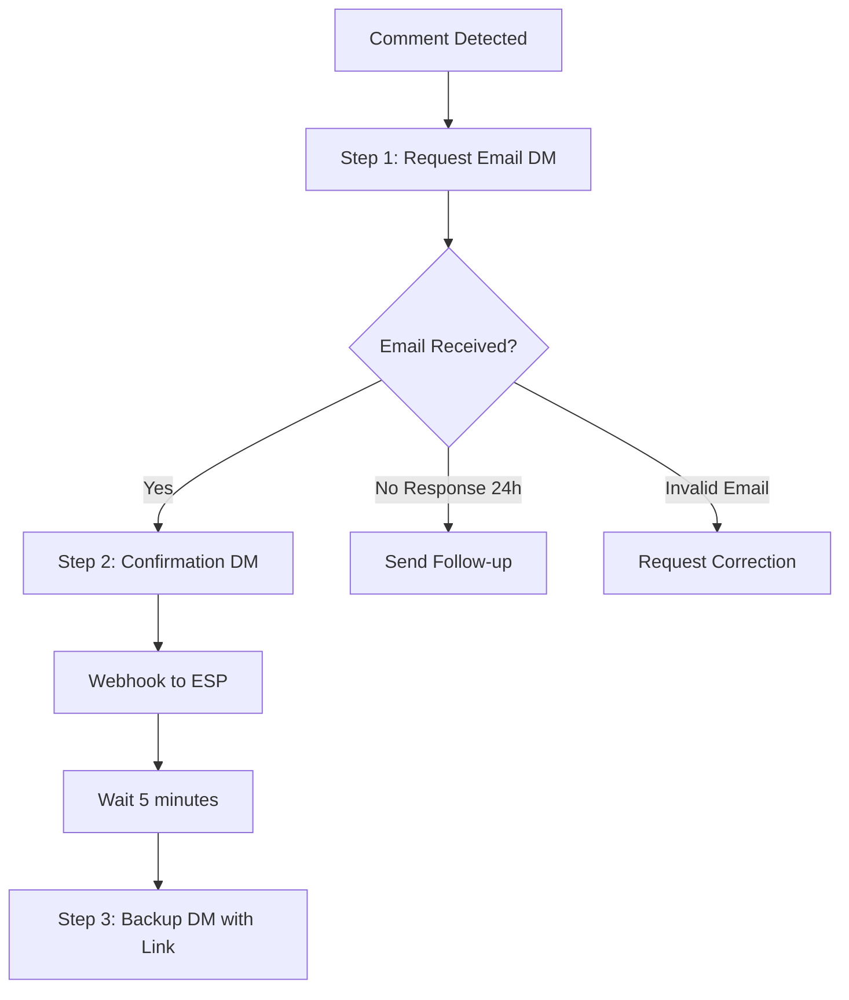

# Three-Step DM Sequence Specification

## Overview

The 3-step DM sequence ensures lead magnet delivery through a carefully orchestrated flow that maximizes conversion while providing multiple delivery options. This sequence handles the initial email request, confirmation, and backup delivery.

## Sequence Flow



## Step 1: Initial Email Request DM

### Trigger
When someone comments with the trigger word (e.g., "SCALE"), immediately send DM.

### Message Generation

```typescript
interface Step1DMParams {
  recipientFirstName: string;
  leadMagnetName: string;
  triggerWord: string;
  campaignContext: {
    postTopic: string;
    valueProposition: string;
  };
}

async function generateStep1DM(params: Step1DMParams): Promise<string> {
  // Step 1: Copywriting Skill generates professional copy
  const dmCopy = await copywritingSkill.generate({
    contentType: 'dm_message',
    objective: 'request_email',
    framework: 'PAS', // Problem-Agitate-Solution
    context: params
  });

  // Example output from copywriting skill:
  // {
  //   hook: "I saw you commented 'SCALE' on my post about leadership challenges...",
  //   body: "The 10x Leadership Framework I mentioned has helped 500+ CEOs transform their teams.
  //          It covers the exact systems you need to scale from 10 to 100+ employees without losing culture.",
  //   cta: "What's the best email to send it to?"
  // }

  // Step 2: Apply Voice Cartridge
  const personalizedDM = await voiceCartridge.transform(dmCopy, {
    maintainCTA: true,
    preserveKeywords: ['email', params.leadMagnetName]
  });

  return personalizedDM;
}
```

### Template Examples

#### Professional Voice
```
Hi {first_name},

I noticed you commented "{trigger_word}" on my post about {post_topic}.

The {lead_magnet_name} I mentioned includes:
• {benefit_1}
• {benefit_2}
• {benefit_3}

What's the best email to send it to?

Best,
{sender_name}
```

#### Casual Voice
```
Hey {first_name}! 👋

Saw your "{trigger_word}" comment - love it!

Ready to grab that {lead_magnet_name}? It's got everything you need for {value_proposition}.

Drop your email and I'll send it right over 📧

Cheers!
```

#### Direct Voice
```
{first_name},

You commented "{trigger_word}".

Send me your email and I'll deliver the {lead_magnet_name} immediately.

It covers: {key_benefits}

Email?
```

### Implementation

```typescript
class Step1DMService {
  private unipile: UnipileClient;
  private bullmq: Queue;
  private copywriting: CopywritingSkill;
  private voiceService: VoiceService;

  async sendInitialDM(
    comment: LinkedInComment,
    campaign: Campaign
  ): Promise<DMResult> {
    // Check if already sent
    const existing = await this.checkExistingDM(comment.authorId);
    if (existing) {
      return { status: 'already_sent', dmId: existing.id };
    }

    // Generate personalized message
    const message = await this.generateMessage({
      recipientFirstName: comment.authorFirstName,
      leadMagnetName: campaign.leadMagnet.name,
      triggerWord: comment.text,
      campaignContext: {
        postTopic: campaign.postTopic,
        valueProposition: campaign.leadMagnet.value
      }
    });

    // Queue for rate-limited sending
    const job = await this.bullmq.add('send-dm', {
      recipientId: comment.authorId,
      message: message,
      campaignId: campaign.id,
      step: 1,
      metadata: {
        commentId: comment.id,
        postUrl: comment.postUrl
      }
    }, {
      delay: this.calculateDelay(), // 2-15 min random
      attempts: 3,
      backoff: {
        type: 'exponential',
        delay: 5000
      }
    });

    // Track in database
    await this.trackDM({
      leadId: comment.authorId,
      campaignId: campaign.id,
      step: 1,
      status: 'queued',
      jobId: job.id,
      scheduledFor: new Date(Date.now() + job.opts.delay)
    });

    return { status: 'queued', jobId: job.id };
  }

  private calculateDelay(): number {
    // Random delay between 2-15 minutes
    const min = 2 * 60 * 1000;
    const max = 15 * 60 * 1000;
    return Math.floor(Math.random() * (max - min) + min);
  }
}
```

## Step 2: Confirmation DM

### Trigger
Immediately after email is extracted from reply.

### Message Generation

```typescript
interface Step2DMParams {
  recipientFirstName: string;
  recipientEmail: string;
  leadMagnetName: string;
  estimatedDeliveryTime: string;
}

async function generateStep2DM(params: Step2DMParams): Promise<string> {
  const templates = {
    professional: `Perfect! I'm sending the {lead_magnet_name} to {email} now.

Check your inbox (and spam folder) in the next few minutes.

If you don't see it within 5 minutes, I'll send you a direct download link right here.`,

    casual: `Awesome! 🎯

Sending {lead_magnet_name} to {email} right now!

Should hit your inbox in a few mins (check spam too just in case).

I'll ping you with a backup link in 5 if needed 👍`,

    direct: `Confirmed.

Sending to: {email}
Document: {lead_magnet_name}
ETA: 2-3 minutes

Backup link coming in 5 minutes if needed.`
  };

  // Apply voice cartridge
  const selectedTemplate = templates[params.voice.style];
  return await voiceCartridge.transform(selectedTemplate, params);
}
```

### Implementation

```typescript
class Step2DMService {
  async sendConfirmationDM(
    lead: Lead,
    email: string,
    campaign: Campaign
  ): Promise<DMResult> {
    // Update lead with email
    await this.updateLead(lead.id, {
      email: email,
      status: 'email_captured',
      emailCapturedAt: new Date()
    });

    // Send webhook to ESP immediately
    const webhookResult = await this.webhookService.send({
      email: email,
      first_name: lead.firstName,
      lead_magnet_url: campaign.leadMagnet.url,
      lead_magnet_name: campaign.leadMagnet.name,
      campaign_id: campaign.id,
      captured_at: new Date().toISOString()
    });

    // Generate confirmation message
    const message = await this.generateConfirmationMessage({
      recipientFirstName: lead.firstName,
      recipientEmail: email,
      leadMagnetName: campaign.leadMagnet.name,
      estimatedDeliveryTime: '2-3 minutes'
    });

    // Send confirmation DM immediately
    const dmResult = await this.unipile.sendMessage({
      recipientId: lead.linkedinId,
      message: message
    });

    // Schedule Step 3 (backup DM)
    await this.scheduleBackupDM(lead, campaign, 5 * 60 * 1000); // 5 minutes

    return dmResult;
  }
}
```

## Step 3: Backup DM with Direct Link

### Trigger
5 minutes after Step 2 (configurable).

### Purpose
- Ensure delivery even if ESP fails
- Provide immediate access for eager leads
- Reduce support requests
- Increase trust by following through

### Message Generation

```typescript
interface Step3DMParams {
  recipientFirstName: string;
  leadMagnetName: string;
  leadMagnetUrl: string;
  expiresIn: string;
}

async function generateStep3DM(params: Step3DMParams): Promise<string> {
  const templates = {
    professional: `Hi {first_name},

As promised, here's your direct access link to the {lead_magnet_name}:

{lead_magnet_url}

This link expires in {expires_in}, so please download it now.

The email should also be in your inbox, but I wanted to make sure you got this either way.

Let me know if you have any questions!`,

    casual: `Hey {first_name}!

Here's that backup link I promised 🎁

{lead_magnet_name}: {lead_magnet_url}

(Link expires in {expires_in} so grab it now!)

Should also be in your email, but wanted to make sure you got it 💪

Enjoy!`,

    direct: `{first_name},

Direct download link:
{lead_magnet_url}

Document: {lead_magnet_name}
Expires: {expires_in}

Download now.`
  };

  // Apply voice cartridge
  return await voiceCartridge.transform(templates[params.voice.style], params);
}
```

### Implementation

```typescript
class Step3DMService {
  private storageService: SupabaseStorageService;
  private linkShortener: LinkShortenerService;

  async sendBackupDM(
    lead: Lead,
    campaign: Campaign,
    config: BackupDMConfig
  ): Promise<DMResult> {
    // Check if backup DM should be sent
    if (!config.enableBackupDM) {
      return { status: 'skipped', reason: 'backup_disabled' };
    }

    // Generate secure download link
    const downloadUrl = await this.generateSecureLink(
      campaign.leadMagnet.storageKey,
      {
        expiresIn: config.linkExpirationHours * 3600, // Convert to seconds
        userId: lead.id,
        campaignId: campaign.id
      }
    );

    // Optional: Shorten URL
    const finalUrl = config.useLinkShortener
      ? await this.linkShortener.shorten(downloadUrl)
      : downloadUrl;

    // Generate message
    const message = await this.generateBackupMessage({
      recipientFirstName: lead.firstName,
      leadMagnetName: campaign.leadMagnet.name,
      leadMagnetUrl: finalUrl,
      expiresIn: `${config.linkExpirationHours} hours`
    });

    // Send backup DM
    const dmResult = await this.unipile.sendMessage({
      recipientId: lead.linkedinId,
      message: message
    });

    // Track delivery
    await this.trackBackupDM({
      leadId: lead.id,
      campaignId: campaign.id,
      downloadUrl: finalUrl,
      expiresAt: new Date(Date.now() + config.linkExpirationHours * 3600000),
      status: 'sent'
    });

    return dmResult;
  }

  private async generateSecureLink(
    storageKey: string,
    options: LinkOptions
  ): Promise<string> {
    // Generate signed URL from Supabase Storage
    const { data, error } = await this.storageService
      .from('lead-magnets')
      .createSignedUrl(storageKey, options.expiresIn);

    if (error) throw error;

    // Add tracking parameters
    const url = new URL(data.signedUrl);
    url.searchParams.append('uid', options.userId);
    url.searchParams.append('cid', options.campaignId);
    url.searchParams.append('source', 'linkedin_dm');

    return url.toString();
  }
}
```

## Configuration Options

### Campaign-Level Settings

```typescript
interface DMSequenceConfig {
  // Step 1 Configuration
  step1: {
    enabled: boolean;
    delayMin: number; // Minutes after comment (default: 2)
    delayMax: number; // Minutes after comment (default: 15)
    retryOnFailure: boolean;
    maxRetries: number;
  };

  // Step 2 Configuration
  step2: {
    enabled: boolean;
    sendImmediately: boolean; // Send right after email capture
    includeDeliveryEstimate: boolean;
    estimateMinutes: number; // Default: 3
  };

  // Step 3 Configuration (Backup DM)
  step3: {
    enabled: boolean;
    delayMinutes: number; // After step 2 (default: 5)
    linkExpirationHours: number; // Default: 24
    useLinkShortener: boolean;
    includeTrackingParams: boolean;
  };

  // Voice Configuration
  voice: {
    style: 'professional' | 'casual' | 'direct';
    useCartridge: boolean; // Always true in production
    cartridgeId: string;
  };

  // Follow-up Configuration
  followUp: {
    enabled: boolean;
    noResponseHours: number; // Send if no email after X hours (default: 24)
    maxFollowUps: number; // Default: 1
  };
}
```

### UI Toggle Component

```jsx
function DMSequenceSettings({ campaign }) {
  const [config, setConfig] = useState(campaign.dmSequence);

  return (
    <Card>
      <CardHeader>
        <CardTitle>DM Sequence Settings</CardTitle>
        <CardDescription>
          Configure the 3-step DM sequence for lead magnet delivery
        </CardDescription>
      </CardHeader>
      <CardContent className="space-y-6">

        {/* Step 1: Initial DM */}
        <div className="space-y-4">
          <div className="flex items-center justify-between">
            <Label className="text-base font-medium">
              Step 1: Initial Email Request
            </Label>
            <Switch
              checked={config.step1.enabled}
              onCheckedChange={(checked) =>
                setConfig({...config, step1: {...config.step1, enabled: checked}})
              }
            />
          </div>
          {config.step1.enabled && (
            <div className="pl-6 space-y-3">
              <div className="grid grid-cols-2 gap-4">
                <div>
                  <Label>Min Delay (minutes)</Label>
                  <Input
                    type="number"
                    value={config.step1.delayMin}
                    onChange={(e) => setConfig({
                      ...config,
                      step1: {...config.step1, delayMin: parseInt(e.target.value)}
                    })}
                  />
                </div>
                <div>
                  <Label>Max Delay (minutes)</Label>
                  <Input
                    type="number"
                    value={config.step1.delayMax}
                    onChange={(e) => setConfig({
                      ...config,
                      step1: {...config.step1, delayMax: parseInt(e.target.value)}
                    })}
                  />
                </div>
              </div>
            </div>
          )}
        </div>

        {/* Step 2: Confirmation */}
        <div className="space-y-4">
          <div className="flex items-center justify-between">
            <Label className="text-base font-medium">
              Step 2: Email Confirmation
            </Label>
            <Switch
              checked={config.step2.enabled}
              onCheckedChange={(checked) =>
                setConfig({...config, step2: {...config.step2, enabled: checked}})
              }
            />
          </div>
          {config.step2.enabled && (
            <div className="pl-6 space-y-3">
              <div className="flex items-center space-x-2">
                <Checkbox
                  checked={config.step2.includeDeliveryEstimate}
                  onCheckedChange={(checked) => setConfig({
                    ...config,
                    step2: {...config.step2, includeDeliveryEstimate: checked}
                  })}
                />
                <Label>Include delivery time estimate</Label>
              </div>
            </div>
          )}
        </div>

        {/* Step 3: Backup DM */}
        <div className="space-y-4">
          <div className="flex items-center justify-between">
            <div>
              <Label className="text-base font-medium">
                Step 3: Backup DM with Direct Link
              </Label>
              <p className="text-sm text-gray-500 mt-1">
                Sends direct download link 5 minutes after confirmation
              </p>
            </div>
            <Switch
              checked={config.step3.enabled}
              onCheckedChange={(checked) =>
                setConfig({...config, step3: {...config.step3, enabled: checked}})
              }
            />
          </div>
          {config.step3.enabled && (
            <div className="pl-6 space-y-3">
              <div className="grid grid-cols-2 gap-4">
                <div>
                  <Label>Delay (minutes after Step 2)</Label>
                  <Input
                    type="number"
                    value={config.step3.delayMinutes}
                    onChange={(e) => setConfig({
                      ...config,
                      step3: {...config.step3, delayMinutes: parseInt(e.target.value)}
                    })}
                  />
                </div>
                <div>
                  <Label>Link Expiration (hours)</Label>
                  <Input
                    type="number"
                    value={config.step3.linkExpirationHours}
                    onChange={(e) => setConfig({
                      ...config,
                      step3: {...config.step3, linkExpirationHours: parseInt(e.target.value)}
                    })}
                  />
                </div>
              </div>
              <div className="flex items-center space-x-2">
                <Checkbox
                  checked={config.step3.useLinkShortener}
                  onCheckedChange={(checked) => setConfig({
                    ...config,
                    step3: {...config.step3, useLinkShortener: checked}
                  })}
                />
                <Label>Use link shortener (bit.ly)</Label>
              </div>
            </div>
          )}
        </div>

        {/* Save Button */}
        <Button className="w-full" onClick={() => saveDMSequenceConfig(campaign.id, config)}>
          Save DM Sequence Settings
        </Button>
      </CardContent>
    </Card>
  );
}
```

## Error Handling

### Email Extraction Failures

```typescript
class EmailExtractionHandler {
  async handleEmailExtraction(dmReply: string): Promise<EmailExtractionResult> {
    // Try to extract email
    const emailRegex = /([a-zA-Z0-9._%+-]+@[a-zA-Z0-9.-]+\.[a-zA-Z]{2,})/g;
    const matches = dmReply.match(emailRegex);

    if (!matches || matches.length === 0) {
      // No email found - send clarification
      return await this.requestClarification('no_email');
    }

    if (matches.length > 1) {
      // Multiple emails found - ask which one
      return await this.requestClarification('multiple_emails', matches);
    }

    // Validate email
    const email = matches[0];
    if (!this.isValidEmail(email)) {
      return await this.requestClarification('invalid_email', email);
    }

    return { success: true, email: email };
  }

  private async requestClarification(
    reason: string,
    context?: any
  ): Promise<EmailExtractionResult> {
    const messages = {
      no_email: "I didn't catch your email address. Could you send it again?",
      multiple_emails: `I see multiple email addresses. Which one should I use: ${context.join(' or ')}?`,
      invalid_email: `"${context}" doesn't look like a valid email. Could you double-check and resend?`
    };

    await this.sendDM(messages[reason]);
    return { success: false, reason: reason, retry: true };
  }
}
```

### Rate Limiting Management

```typescript
class RateLimitManager {
  private limits = {
    dmsPerDay: 50,
    dmsPerHour: 10,
    minDelaySeconds: 120,
    maxDelaySeconds: 900
  };

  async canSendDM(accountId: string): Promise<boolean> {
    const dailyCount = await this.getDailyCount(accountId);
    const hourlyCount = await this.getHourlyCount(accountId);

    return dailyCount < this.limits.dmsPerDay &&
           hourlyCount < this.limits.dmsPerHour;
  }

  async getNextAvailableSlot(accountId: string): Promise<Date> {
    const lastDM = await this.getLastDMTime(accountId);
    const minDelay = this.limits.minDelaySeconds * 1000;
    const randomDelay = Math.random() *
      (this.limits.maxDelaySeconds - this.limits.minDelaySeconds) * 1000;

    return new Date(lastDM.getTime() + minDelay + randomDelay);
  }
}
```

## Analytics & Tracking

```typescript
interface DMSequenceMetrics {
  step1: {
    sent: number;
    delivered: number;
    replied: number;
    replyRate: number;
    avgResponseTime: number;
  };

  step2: {
    sent: number;
    delivered: number;
    webhooksSent: number;
    webhookSuccessRate: number;
  };

  step3: {
    sent: number;
    delivered: number;
    linksClicked: number;
    clickRate: number;
    downloadsCompleted: number;
  };

  overall: {
    totalLeads: number;
    emailsCaptured: number;
    captureRate: number;
    avgTimeToEmail: number;
    avgTimeToDownload: number;
  };
}
```

## Database Schema

```sql
-- DM sequence tracking
CREATE TABLE dm_sequences (
  id UUID PRIMARY KEY DEFAULT uuid_generate_v4(),
  lead_id UUID REFERENCES leads(id),
  campaign_id UUID REFERENCES campaigns(id),

  -- Step 1
  step1_sent_at TIMESTAMPTZ,
  step1_delivered_at TIMESTAMPTZ,
  step1_message TEXT,
  step1_job_id TEXT,

  -- Step 2
  step2_sent_at TIMESTAMPTZ,
  step2_delivered_at TIMESTAMPTZ,
  step2_message TEXT,
  email_captured TEXT,
  email_captured_at TIMESTAMPTZ,
  webhook_sent_at TIMESTAMPTZ,
  webhook_status TEXT,

  -- Step 3
  step3_scheduled_for TIMESTAMPTZ,
  step3_sent_at TIMESTAMPTZ,
  step3_delivered_at TIMESTAMPTZ,
  step3_message TEXT,
  download_url TEXT,
  download_url_expires_at TIMESTAMPTZ,
  link_clicked_at TIMESTAMPTZ,

  -- Overall status
  status TEXT CHECK (status IN ('in_progress', 'completed', 'failed', 'abandoned')),
  completed_at TIMESTAMPTZ,

  created_at TIMESTAMPTZ DEFAULT NOW(),
  updated_at TIMESTAMPTZ DEFAULT NOW()
);

-- Create indexes
CREATE INDEX idx_dm_sequences_lead_id ON dm_sequences(lead_id);
CREATE INDEX idx_dm_sequences_campaign_id ON dm_sequences(campaign_id);
CREATE INDEX idx_dm_sequences_status ON dm_sequences(status);
CREATE INDEX idx_dm_sequences_step3_scheduled ON dm_sequences(step3_scheduled_for)
  WHERE step3_scheduled_for IS NOT NULL;
```

## Summary

The 3-step DM sequence provides:

1. **Step 1**: Professional email request with voice personalization
2. **Step 2**: Immediate confirmation with delivery expectations
3. **Step 3**: Backup direct link after 5 minutes for guaranteed delivery

Key features:
- Full copywriting skill + voice cartridge integration
- Configurable delays and retry logic
- Toggle for backup DM (can be disabled)
- Multiple voice styles (professional, casual, direct)
- Comprehensive error handling
- Rate limit management
- Complete analytics tracking

This ensures maximum lead capture and delivery success while maintaining authentic, personalized communication.