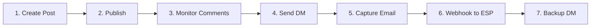

# Bravo revOS - Master Specification

**Version:** 1.0.0
**Status:** MVP Ready
**Last Updated:** November 3, 2025
**Project ID:** de2e1ce0-3d40-4cbe-80eb-8d0fd14fb531

## Executive Summary

Bravo revOS is an AI-powered LinkedIn lead generation system that automates the entire funnel from content creation to lead magnet delivery. It leverages copywriting AI + voice personalization to create authentic content, monitors for engagement, and delivers lead magnets through a sophisticated multi-channel approach.

**Core Value Proposition:** Transform LinkedIn connections into qualified leads automatically while maintaining authentic, personalized communication.

---

## System Architecture

### Application Structure

**ONE Next.js 14 Application** with role-based routing:

```
/ (landing page)
├── /admin          → Agency admin portal
├── /dashboard      → Client dashboard
├── /settings       → Account settings
└── /api           → Backend endpoints
```

**NOT** three separate applications. Everything is ONE unified system with role-based access control.

### Technology Stack

#### Core Infrastructure
- **Frontend:** Next.js 14 (App Router), TypeScript, Tailwind CSS, shadcn/ui
- **Backend:** Next.js API routes, tRPC for type safety
- **Database:** Supabase (PostgreSQL with Row Level Security)
- **Storage:** Supabase Storage for lead magnets
- **Queue:** BullMQ + Upstash Redis for rate-limited operations
- **Deployment:** Render (backend) + Netlify (frontend)

#### LinkedIn Integration
- **API:** Unipile API ($5.50/account/month)
  - ✅ Posts, DMs, Profile data, DM webhooks
  - ❌ NO comment webhooks (must poll)
- **V2 Only:** Playwright for browser automation (resharing)

#### AI & Intelligence
- **Content Generation:** GPT-4o for copywriting skill
- **Voice Transformation:** GPT-4o for voice cartridge
- **Email Extraction:** GPT-4o for parsing DM replies
- **Memory:** Mem0 ($20/month) + PGVector for semantic search
- **Orchestration:** AgentKit for campaign management

### Multi-Tenancy Hierarchy

```
Agencies (top level)
    ↓
Clients (businesses)
    ↓
Users (team members)
```

All data isolation via Supabase RLS policies.

---

## Core Features

### 1. AI-Powered Content Pipeline

Every piece of content flows through a two-stage transformation:

```
[User Input/Brief]
    ↓
[Copywriting Skill] → Professional, conversion-optimized copy
    ↓
[Voice Cartridge] → User's authentic voice and tone
    ↓
[Final Output]
```

#### Copywriting Skill
- **Frameworks:** AIDA (posts), PAS (DMs), VALUE (comments)
- **Optimization:** Headlines, hooks, CTAs, value propositions
- **Modes:** AI (automatic), Human (manual), Scheduled

#### Voice Cartridge System
- **4-Tier Hierarchy:** System → Workspace → User → Skills
- **Auto-Generation:** Analyzes last 30 LinkedIn posts
- **Parameters:** Tone, style, personality, vocabulary, patterns
- **Mandatory:** ALL content must pass through voice filter

### 2. Lead Generation Flow (7 Steps)



#### Step Details

1. **Post Creation**
   - AI generates using copywriting skill
   - Voice cartridge personalizes
   - Clear CTA with trigger word (e.g., "Comment SCALE")

2. **Publication**
   - Via Unipile API
   - Rate limited: 25 posts/day
   - Scheduled for optimal times

3. **Comment Monitoring**
   - **CRITICAL:** Poll every 15-30 min (NO webhooks available)
   - Detect trigger words
   - Queue DMs for responders

4. **Initial DM**
   - 2-15 minute random delay
   - Request email address
   - Personalized with voice filter

5. **Email Capture**
   - Extract from DM reply (regex + GPT-4o)
   - Send confirmation DM immediately
   - Update lead status

6. **Webhook Delivery**
   - POST to client's ESP webhook
   - Include lead data + download URL
   - Client's ESP sends actual email
   - **We do NOT send emails directly**

7. **Backup DM**
   - 5 minutes after confirmation
   - Direct download link
   - 24-hour expiration
   - Ensures delivery

### 3. Engagement Pods

**Critical Understanding:** EVERYONE engages with EVERYTHING

```javascript
When any pod member posts:
- ALL other members (8+ minimum) automatically:
  - Like within 30 minutes (algorithm window)
  - Comment within 1-3 hours
  - Instant repost (NOT "repost with thoughts")
- NO selection/rotation - 100% participation
```

**Why This Works:**
- LinkedIn algorithm prioritizes early engagement
- First 30 min - 3 hours determines reach
- Volume overcomes pod detection penalties (~30% reduction)

### 4. Campaign Management

#### Campaign Configuration
```typescript
interface Campaign {
  // Lead Magnet
  leadMagnet: {
    title: string;
    file: File; // Uploaded to Supabase Storage
    description: string;
    value: string;
  };

  // Targeting
  triggerWord: string; // e.g., "SCALE"
  postSchedule: CronExpression;

  // Delivery
  webhook: {
    url: string; // Client's ESP endpoint
    secret?: string; // HMAC signing
  };

  // DM Sequence
  dmSequence: {
    step1Delay: [min: number, max: number];
    step3Enabled: boolean; // Backup DM toggle
    step3Delay: number; // Minutes after step 2
  };

  // Skills
  skills: {
    copywriting: 'ai' | 'human' | 'scheduled';
    voice: string; // Cartridge ID (always applied)
  };
}
```

### 5. Analytics & Monitoring

Real-time dashboard tracking:
- **Posts:** Impressions, comments, trigger rate
- **DMs:** Sent, delivered, reply rate
- **Leads:** Captured, conversion rate
- **Webhooks:** Delivery success, response times
- **Pods:** Engagement metrics, participation

---

## User Interface

### Admin Portal (`/admin`)

Agency administrators can:
- Manage multiple clients
- View system-wide analytics
- Configure global settings
- Monitor API usage and billing

### Client Dashboard (`/dashboard`)

Clients can:
- Create and manage campaigns
- Upload lead magnets
- Configure webhook endpoints
- View lead analytics
- Export lead data (CSV)
- Manage team members

### Key UI Components

#### Campaign Wizard
1. Lead magnet upload
2. Post content creation (AI or manual)
3. Trigger word selection
4. Webhook configuration
5. DM sequence settings
6. Review and launch

#### Webhook Settings
- ESP presets (Zapier, Make, ConvertKit, etc.)
- Custom webhook configuration
- Test tool with sample payload
- Delivery history and logs

#### Skills Configuration
- Toggle between AI/Human/Scheduled
- Voice cartridge selection
- Skill chaining setup
- Preview generated content

---

## Data Model

### Core Tables

```sql
-- Multi-tenant structure
agencies
clients (belongs to agency)
users (belongs to client)

-- LinkedIn Integration
linkedin_accounts (encrypted credentials)
posts
comments
dm_sequences

-- Lead Management
campaigns
leads
lead_magnets (Supabase Storage refs)

-- Delivery
webhook_configs
webhook_deliveries

-- Engagement
pods (min 9 members)
pod_members
pod_activities

-- AI/Skills
cartridges (4-tier hierarchy)
campaign_skills
skill_executions

-- Memory
memories (Mem0 integration)
```

### Key Relationships
- Agencies → Clients (1:many)
- Clients → Users (1:many)
- Clients → Campaigns (1:many)
- Campaigns → Leads (1:many)
- Users → LinkedIn Accounts (1:many)
- Pods → Pod Members (many:many)

---

## Integration Details

### Unipile API

**Authentication:**
```javascript
const session = await unipile.auth({
  provider: 'linkedin',
  username: linkedinEmail,
  password: linkedinPassword // Encrypted
});
```

**Key Operations:**
- `createPost()` - Publish content
- `getPostComments()` - Poll for comments (NO webhook)
- `sendMessage()` - Send DMs
- `getConversationMessages()` - Monitor DM replies

**Rate Limits:**
- Posts: 25/day
- DMs: 50/day
- API calls: 1000/hour

### Webhook Format

```json
{
  "email": "john@example.com",
  "first_name": "John",
  "last_name": "Doe",
  "linkedin_url": "https://linkedin.com/in/johndoe",
  "lead_magnet_name": "10x Leadership Framework",
  "lead_magnet_url": "https://storage.supabase.co/...",
  "campaign_id": "camp_123",
  "captured_at": "2025-11-03T10:00:00Z",
  "source": "linkedin_comment",
  "metadata": {
    "post_url": "https://...",
    "trigger_word": "SCALE"
  }
}
```

### Memory System (Mem0)

```javascript
// Store successful patterns
await mem0.add({
  userId: userId,
  memory: {
    type: 'successful_post',
    content: postContent,
    metrics: { comments: 45, leads: 12 }
  }
});

// Retrieve for optimization
const memories = await mem0.search({
  userId: userId,
  query: 'high converting posts'
});
```

---

## Security & Compliance

### Data Protection
- All LinkedIn credentials encrypted at rest
- Webhook secrets for HMAC verification
- 24-hour expiring download links
- RLS policies for tenant isolation

### Rate Limiting
- Per-account LinkedIn limits enforced
- Random delays to appear human
- Exponential backoff on failures
- Account health monitoring

### Compliance
- GDPR: Data deletion on request
- CAN-SPAM: Unsubscribe handling
- LinkedIn ToS: Respecting rate limits
- Client owns lead data

---

## Implementation Roadmap

### Phase 1: MVP (100 points) ← CURRENT
1. **Session 1:** Bolt.new scaffold (15 pts)
2. **Session 2:** Cartridge system (20 pts)
3. **Session 3:** Unipile + BullMQ (20 pts)
4. **Session 4:** Email capture + Webhook (20 pts)
5. **Session 5:** Engagement pods (15 pts)
6. **Session 6:** AgentKit + Mem0 (10 pts)
7. **Session 7:** Testing + Monitoring (5 pts)

### Phase 2: V2 Features (90 points)
- Playwright browser automation
- LinkedIn resharing automation
- Advanced pod coordination
- Email sequences
- Apollo.io integration

---

## Critical Implementation Notes

### ⚠️ Must Remember

1. **Comment Monitoring:** Unipile has NO webhook for comments - MUST poll
2. **Engagement Pods:** EVERYONE engages, no rotation or selection
3. **Email Delivery:** We send webhooks only - client's ESP sends emails
4. **Voice Filter:** Mandatory on ALL content, no exceptions
5. **Architecture:** ONE app with routing, NOT multiple apps
6. **Skills Flow:** Copywriting → Voice → Output (always in that order)

### Common Pitfalls to Avoid

❌ Building separate admin/client portals
❌ Implementing fair rotation for pods
❌ Sending emails directly via Mailgun
❌ Expecting comment webhooks from Unipile
❌ Skipping voice filter on any content
❌ Using Playwright in MVP (V2 only)

---

## Testing Strategy

### Unit Tests
- Copywriting skill generation
- Voice cartridge transformation
- Email extraction regex
- Webhook payload construction

### Integration Tests
- Unipile API operations
- Supabase RLS policies
- BullMQ job processing
- Mem0 memory storage

### E2E Tests
- Complete lead flow (post → lead)
- Pod engagement automation
- Webhook delivery + retry
- Multi-tenant isolation

---

## Monitoring & Observability

### Key Metrics
- **Lead Velocity:** Leads/day, conversion rate
- **Content Performance:** Engagement rates, trigger rates
- **System Health:** API errors, queue depth, webhook failures
- **Pod Efficiency:** Participation rate, timing accuracy

### Alerting
- Failed webhook deliveries > 3
- Comment polling failures > 3 consecutive
- DM rate limit approaching
- Low pod participation

---

## Developer Quick Start

```bash
# Clone repository
git clone [repo-url]
cd bravo-revos

# Install dependencies
npm install

# Set up environment
cp .env.example .env
# Add: SUPABASE_URL, SUPABASE_KEY, UNIPILE_KEY, etc.

# Run database migrations
npm run db:migrate

# Start development
npm run dev

# Run tests
npm run test
```

---

## Support & Documentation

### Internal Docs
- `/docs/projects/bravo-revos/` - All specifications
- `/docs/api/` - API documentation
- `/docs/guides/` - Implementation guides

### External Resources
- [Unipile API Docs](https://developer.unipile.com)
- [Mem0 Documentation](https://docs.mem0.ai)
- [BullMQ Guide](https://docs.bullmq.io)
- [Supabase RLS](https://supabase.com/docs/guides/auth/row-level-security)

---

## Conclusion

Bravo revOS delivers a complete LinkedIn lead generation solution through:
1. **AI-Powered Content** that converts (copywriting + voice)
2. **Automated Detection** of interested prospects
3. **Multi-Channel Delivery** ensuring leads receive magnets
4. **Pod Amplification** for maximum reach
5. **Intelligent Memory** that improves over time

The system is designed to be maintainable, scalable, and compliant while delivering exceptional conversion rates through authentic, personalized communication.

---

**Document Version:** 1.0.0
**Last Updated:** November 3, 2025
**Status:** Ready for MVP Implementation