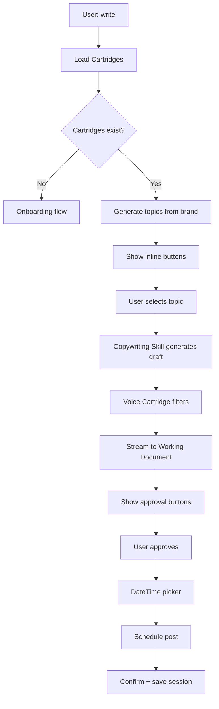
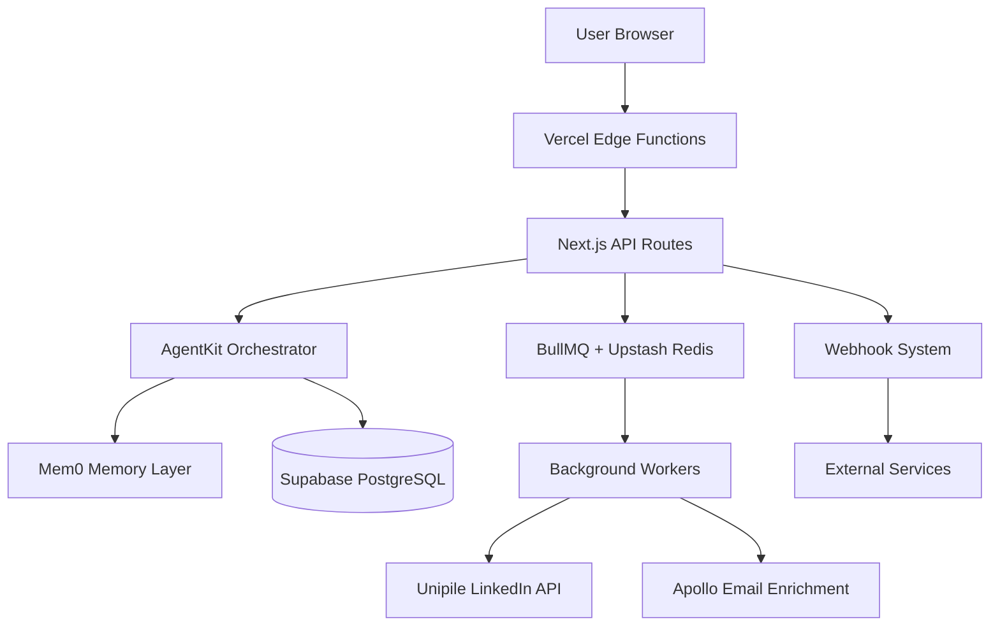

# RevOS Complete Functional Specification Document (FSD)
**Version:** 2.0 (Chat-First Evolution)  
**Date:** November 15, 2025  
**Status:** Production Ready  
**Purpose:** Definitive functional requirements for RevOS HGC implementation

---

## 1. Executive Summary

### 1.1 Product Overview

**RevOS** is a chat-first LinkedIn growth automation platform powered by Holy Grail Chat (HGC). Unlike traditional dashboard-first SaaS tools, RevOS uses conversational AI to orchestrate workflows where users accomplish tasks through natural language while watching the system work in real-time.

**Core Innovation:**
- **Chat-driven UI orchestration** - Users talk, system navigates and fills forms automatically
- **Cartridge-based personalization** - Every response personalized via brand/style/voice context
- **Real-time transparency** - Users watch actions happen (trust through visibility)
- **Pod amplification** - Coordinated network effects multiply LinkedIn reach 10-100x

### 1.2 Key Differentiators

**vs Traditional Tools (LinkedHelper, Phantombuster):**
- They: Dashboard navigation, manual setup, generic templates
- We: Natural language, auto-orchestration, cartridge-personalized content

**vs Kakiyo (Direct Competitor):**
- They: Good SDR replacement, no memory, individual automation
- We: Persistent memory (Mem0), pod networks, extensible cartridge architecture

**vs Building In-House:**
- Would require: AgentKit expertise, Mem0 integration, cartridge architecture, pod coordination
- Time to market: 12+ months vs our 3 months
- Cost: $500k+ in dev costs vs our $99-299/month

### 1.3 Success Metrics

**User Engagement:**
- 80% of interactions via chat (vs 20% dashboard)
- <30 seconds average time to complete tasks
- 90% user satisfaction with chat interface

**Business Outcomes:**
- 10x LinkedIn reach multiplier via pods
- 30%+ email capture rate from campaigns
- 40% reply rate improvement with conversation intelligence
- 90% monthly retention rate

---

## 2. User Personas

### 2.1 Persona: Chase (Super Admin)

**Demographics:**
- Age: 35-45
- Role: RevOS Founder/Operator
- Technical Skill: High (full-stack developer)
- LinkedIn: 10,000+ connections
- Use Case: Platform management + client support

**Goals:**
1. Monitor system health across all tenants
2. Track profitability (OpenAI costs, Unipile spend)
3. Identify performance issues proactively
4. Support clients when blocked
5. Review AI-generated content quality

**Pain Points:**
- Need visibility into ANY client account instantly
- Must troubleshoot issues without manual database queries
- Track per-client costs (OpenAI tokens, Unipile accounts)
- Ensure AI quality (review generated posts/DMs)
- Manage multi-tenant complexity

**Primary Workflows:**

**1. System Health Monitoring:**
```
Chase: "show system health"
HGC: [Navigates to /admin/system-health]

Display:
✓ Database: 45ms response time
✓ Supabase: Operational
✓ OpenAI: 234 req/min, $12.45/hour
✓ Mem0: 1.2GB used, 89% cache hit rate
✓ Unipile: 47 accounts, all connected
⚠ Queue: 234 jobs pending (normal)
✗ Email Worker: 2 failures (investigate)
```

**2. Client Account Access:**
```
Chase: "access Rachel's account"
HGC: [Switches tenant context to Rachel's clientId]
"Switched to Rachel Chen (Executive Coach). What would you like to check?"

Chase: "show her campaigns"
HGC: [Loads Rachel's campaigns with RLS bypass via service role key]
"Rachel has 3 active campaigns:
1. Building Trust (32 sent, 12 replies)
2. Executive Presence (18 sent, 7 replies)
3. Conflict Management (Draft)"
```

**3. Cost Tracking:**
```
Chase: "openai costs last 7 days"
HGC: [Query usage_logs table]

"OpenAI Spend (Nov 8-15):
Total: $487.23
- GPT-4o: $412.50 (84.7%)
- Embeddings: $74.73 (15.3%)

Top Users:
1. Jake (Startup): $89.40 (18.3%)
2. Rachel (Coach): $67.20 (13.8%)
3. Michael (Agency): $54.10 (11.1%)

[Export CSV] [Show by Feature]"
```

**Acceptance Criteria:**
- Super admin can impersonate ANY tenant via chat
- System health checks update real-time (<30s refresh)
- Cost tracking accurate to $0.01
- Can export all data to CSV
- Audit log tracks all admin actions

---

### 2.2 Persona: Rachel (Client - Executive Coach)

**Demographics:**
- Age: 48
- Business: Leadership coaching for VPs/C-suite executives
- Revenue: $800k/year
- Team: Solo practitioner + 1 VA
- LinkedIn: 8,000 connections (highly engaged network)
- Tech Savvy: Medium (comfortable with Zoom, Calendly, not technical)

**Psychographics:**
- Values: Authenticity, depth, transformation over tactics
- Communication Style: Warm but professional, storytelling-focused
- Decision Making: Intuitive + data-informed
- Time Constraints: Extremely busy (20+ client calls/week)

**Goals:**
1. Generate 20-30 qualified leads/month (VPs, C-suite)
2. Book 10-15 discovery calls/month
3. Close 2-3 new clients/month ($10k coaching packages)
4. Spend <1 hour/week on lead generation
5. Maintain authentic voice (not sound "automated")

**Pain Points:**
- Too busy for consistent LinkedIn posting
- Manual DM outreach takes hours she doesn't have
- Hard to track who she's messaged, who replied
- Doesn't want to "learn another tool" (dashboard overwhelm)
- Concerned AI will make her sound generic

**Brand Context (Stored in Brand Cartridge):**
```json
{
  "industry": "executive coaching",
  "target_audience": "VPs, C-suite executives, senior leaders",
  "core_messaging": [
    "Conflict is growth",
    "Vulnerability drives performance",
    "Leadership is about creating safety for hard conversations"
  ],
  "core_values": ["authenticity", "transformation", "courage"],
  "brand_voice": "Warm, story-driven, provocative (in service of growth)"
}
```

**Style Context (Stored in Style Cartridge):**
```json
{
  "tone_of_voice": "Professional but warm, conversational",
  "writing_style": "Short paragraphs, story hooks, unexpected insights",
  "personality_traits": ["empathetic", "direct", "thought-provoking"],
  "content_examples": [
    "Uploaded: Rachel_Post_Examples.pdf (12 posts)",
    "Analyzed: Storytelling structure, conflict-as-theme, personal anecdotes"
  ]
}
```

**Primary Workflows:**

**1. Create LinkedIn Post (Most Common - 3x/week):**
```
Rachel: "write"

[HGC loads brand + style cartridges from database]

HGC: "📋 **Brand Context Loaded**
Industry: Executive Coaching
Target: C-suite leaders and senior executives
Voice: Professional but warm, conversational

Select a topic to write about:

[Building Trust with Remote VPs]
[Executive Presence Under Pressure]
[Conflict as Growth Tool]
[Custom Topic]"

Rachel: [clicks Building Trust with Remote VPs]

[Post generated and sent to Working Document area]

Working Document shows (dashed border panel):
───────────────────────────────
LinkedIn Post: building trust with remote VPs

I had a VP ask me yesterday: 'My remote team isn't arguing anymore...
and that terrifies me.'

Silence isn't harmony. It's fear.

Here's how to create psychological safety where healthy conflict thrives:
1. Reward dissent publicly
2. Share your own mistakes first
3. Ask 'What am I missing?' in every meeting

Conflict isn't the problem. Silence is.
───────────────────────────────

Chat shows ONLY:
HGC: "✅ LinkedIn post generated in working document"

Rachel: [edits post in Working Document, then saves]

HGC: "Post saved. Ready to schedule?

📅 2025-11-16
🕐 09:00 EST

[Schedule Post] [Post Now] [Save as Draft]"

Rachel: [adjusts to 10:30 AM, clicks Schedule Post]

HGC: "✅ Scheduled for Nov 16, 10:30 AM EST."
```

**CRITICAL UX RULES:**
- ❌ NO campaign selection during write flow (attach to campaigns later)
- ❌ Generated content NEVER appears in chat
- ❌ NO "Select from existing campaigns" prompts
- ✅ Working Document = Content output (like Microsoft Word)
- ✅ Chat = Navigation, confirmations, buttons only
- ✅ Brand context shown BEFORE topic selection

**2. Create Campaign from Post (1x/week):**
```
[Rachel posted yesterday, got 47 comments]

Rachel: "campaign"

HGC: [Navigates to /dashboard/campaigns]
"Let's create a campaign. Would you like to:

[Create from LinkedIn Post]
[Create from Scratch]"

Rachel: [clicks Create from LinkedIn Post]

HGC: "Paste your LinkedIn post URL"

Rachel: "https://linkedin.com/posts/rachel-coach-123..."

HGC: [Navigates to /dashboard/campaigns/new]
[Auto-fills form AS RACHEL WATCHES]

Form shows (populating in real-time):
Campaign Name: Building Trust with Remote Teams ✓
Source Post: linkedin.com/posts/... ✓
Target Leads: 47 commenters found ✓

HGC: "Found 47 people who commented. Enriching profiles...
✓ 10/47
✓ 25/47
✓ 47/47 complete

Found emails for 32 people (68% success rate).

Here are sample DMs I'll send:"

---
DM 1 (to Sarah):
"Sarah - your comment about building trust with remote teams really hit home.
I just created a guide on the 5 conversations every remote leader must have.
Want me to send it over?"

DM 2 (to Mike):
"Mike - loved your point about vulnerability in leadership.
I work with VPs navigating exactly this.
Created a free assessment that might help - interested?"
---

[Approve & Send] [Make More Casual] [Regenerate]"

Rachel: [clicks Approve & Send]

HGC: "Campaign activated. I'll send 20 DMs/day (LinkedIn limits) and notify 
you of replies. You can check status anytime by saying 'campaign status'."
```

**3. Review Leads (2x/week):**
```
Rachel: "who replied?"

HGC: [Loads recent campaign activity]
"From your 'Building Trust' campaign:

Replies (12 total):
1. Sarah M. (VP Ops, TechCorp) - Interested in guide
2. Mike L. (COO, StartupXYZ) - Asked about coaching
3. Lisa T. (Director, Fortune 500) - Wants to chat

[View All] [Schedule Calls] [Send Follow-up]"

Rachel: "schedule calls"

HGC: "I'll send your Calendly link to Sarah, Mike, and Lisa. 
Which availability?"

[Next 7 Days] [Specific Dates] [Custom Message]"

Rachel: [clicks Next 7 Days]

HGC: "Sent. I'll notify you when they book."
```

**Acceptance Criteria:**
- Rachel never sees "cartridges" or technical terms
- All content matches her authentic voice (verified by Rachel)
- <30 seconds from "write" to scheduled post
- DMs feel personalized (use commenter names, reference their comments)
- Weekly summary email (no need to check dashboard)

---

### 2.3 Persona: Jake (Client - Startup Founder)

**Demographics:**
- Age: 32
- Business: B2B SaaS (project management tool for remote teams)
- Stage: Pre-seed ($500k raised from angels)
- Team: 4 people (2 eng, 1 design, Jake)
- LinkedIn: 3,500 connections (growing fast)
- Tech Savvy: Very high (ex-engineer, understands APIs)

**Psychographics:**
- Values: Data-driven decisions, speed, learning
- Communication Style: Direct, concise, metric-focused
- Decision Making: Test → measure → iterate
- Time Constraints: Building product 60hr/week

**Goals:**
1. Find 50-100 early adopters (product managers, startup founders)
2. Book 20 product demos/month
3. Convert 10% to beta users
4. Build personal brand as founder (thought leadership)
5. Show traction to investors (metrics matter)

**Pain Points:**
- No time for outreach (coding full-time)
- Generic cold emails get ignored
- Need to show investor progress (dashboards crucial)
- Want to A/B test messaging
- Needs detailed funnel metrics

**Brand Context:**
```json
{
  "industry": "B2B SaaS, project management",
  "target_audience": "Product managers, startup founders, remote team leads",
  "core_messaging": [
    "Async-first collaboration",
    "Built for remote teams from day 1",
    "Transparency creates trust"
  ],
  "core_values": ["transparency", "speed", "user-centric"],
  "brand_voice": "Technical but accessible, founder-authentic"
}
```

**Primary Workflows:**

**1. Create Feature Launch Campaign:**
```
Jake: "Create campaign for our new feature launch"

HGC: [Loads brand cartridge, navigates to /dashboard/campaigns/new]
"Let's launch your feature. What's the feature called?"

Jake: "Async standup reports"

HGC: "Perfect. I'll create a campaign targeting product managers. 
Should I:

[Generate LinkedIn Post]
[Create Direct Outreach]  
[Both - Post + DM Sequence]"

Jake: [clicks Both]

HGC: [Generates post using brand context]

Working Document shows:
"We just shipped async standup reports.

Why? Because forcing your London team to join a 9 AM PST standup is broken.

Now your team:
- Records updates on their time  
- Reviews when focused
- No more timezone hell

Beta access: [link]

What's the worst timezone conflict you've dealt with?"

Chat shows:
HGC: "Post ready. Check document for preview.

For DM outreach, who should I target?"

[LinkedIn Post Commenters]
[Imported CSV]
[Search Apollo for 'product managers']"

Jake: [clicks Search Apollo]

HGC: "Searching Apollo for product managers at startups...
Found 247 matches. Refine by:

[Company Size]
[Location]  
[Tech Stack]
[Use All 247]"

Jake: [clicks Company Size]

HGC: [Shows inline filter]
"Company size:
◉ 10-50 employees (147 people)
○ 50-200 employees (78 people)
○ 200+ employees (22 people)

[Apply Filter]"

Jake: [selects 10-50, clicks Apply]

HGC: "147 product managers at 10-50 person startups.
Enriching emails...
✓ 147/147 complete

Found 89 emails (60.5% success).

Sample DM:

'[Name] - saw you're building at [Company]. 
We just launched async standups for remote teams.
Early beta access if you want to test before launch.
Interested?'

[Approve & Send] [Make More Technical] [A/B Test]"

Jake: [clicks A/B Test]

HGC: "A/B test setup:

Variant A (50%): Focus on async benefits
Variant B (50%): Focus on timezone pain

I'll track reply rates and auto-optimize after 20 sends.

[Start Test] [Edit Variants]"

Jake: [clicks Start Test]

HGC: "A/B test started. 
Sending 20/day, will notify you of statistical significance.
Track progress: /dashboard/campaigns/async-standup"
```

**2. Analyze Campaign Performance (Daily):**
```
Jake: "How's the async standup campaign doing?"

HGC: [Loads campaign, navigates to /dashboard/campaigns/async-standup]

"Your 'Async Standup Launch' campaign (Nov 8-15):

✓ 89 DMs sent  
✓ 31 replies (34.8% reply rate)
✓ 18 demos booked (58% conversion)
✓ 6 beta signups (33% demo → signup)

A/B Test Results:
Variant A (async benefits): 28% reply rate
Variant B (timezone pain): 41% reply rate ✓ WINNER

Top performing message:
'Forcing London teams on 9 AM PST standups is broken'
- 12 replies / 24 sent = 50% reply rate

[Use Variant B Going Forward] [Export Leads] [Scale Up]"

[Dashboard shows funnel visualization]

Jake: [clicks on "31 replies" in funnel]

[Modal shows list of 31 people who replied]

Jake: "export this list"

HGC: "Exported 31 leads to CSV.
[Download] [Send to Slack] [Add to HubSpot]"
```

**Acceptance Criteria:**
- Jake can query any metric via chat
- A/B testing automated (no manual tracking)
- Dashboard shows real-time funnel updates
- Can export to CSV, send to integrations
- Statistical significance calculated automatically

---

## 3. Core User Journeys

### 3.1 Journey: First-Time User Onboarding

**Goal:** User goes from signup → first campaign live in <10 minutes

**Steps:**

**1. Signup + LinkedIn Connection (2 min):**
```
User lands on revos.ai
Clicks "Start Free Trial"
Connects LinkedIn via Unipile OAuth
Redirected to RevOS dashboard
```

**System Actions:**
- Create user record in Supabase
- Store Unipile account_id
- Initialize default cartridges (brand, style, voice, preferences)

**2. Brand Cartridge Setup (3 min):**
```
HGC: "Welcome to RevOS! Let's set up your brand so I can personalize 
everything for you.

What industry are you in?"

User: "executive coaching"

HGC: "Perfect. Who's your ideal client?"

User: "VPs and C-suite executives"

HGC: "Got it. What makes your approach unique?"

User: "I help leaders have difficult conversations with courage"

HGC: "Excellent. I'll use this to personalize all your content.
Let's create your first LinkedIn post to test the system."
```

**System Actions:**
- Save to brand_cartridge table
- Load into Mem0 for persistent memory

**3. First Post Creation (2 min):**
```
[Using journey 2.2 workflow above]

User: "write"
HGC: [Shows personalized topics based on brand cartridge]
User: [Selects topic]
HGC: [Generates post, user approves, schedules]
```

**4. First Campaign Setup (3 min):**
```
HGC: "Great! That post will go live tomorrow at 10 AM.

Want to turn it into a lead generation campaign? I can:
1. Monitor comments
2. Send DMs offering a free resource
3. Extract emails automatically

[Set Up Campaign] [Just Post for Now]"

User: [clicks Set Up Campaign]

[Using journey 2.2 campaign workflow]
```

**Acceptance Criteria:**
- Signup → first post scheduled in <10 min
- Brand cartridge populated with 3+ data points
- User understands chat-first interaction model
- First campaign ready to activate

---

### 3.2 Journey: Daily Content Creation (Power User)

**Goal:** Create and schedule 3 posts in <5 minutes

**Flow:**

```
User: "write 3 posts"

HGC: [Loads brand + style cartridges]
"I'll create 3 posts. Topics?"

[Auto-suggest from brand] [Custom Topics] [Recent LinkedIn Trends]"

User: [clicks Auto-suggest]

HGC: "Based on your recent themes:

Post 1: [Trust in remote teams]
Post 2: [Executive presence under pressure]
Post 3: [Conflict as leadership tool]

[Generate All 3] [Pick Topics Separately]"

User: [clicks Generate All 3]

[Working Document shows 3 posts streaming in sequence]

HGC: "Posts ready. Schedule as:

[Mon/Wed/Fri next week]
[Custom dates]
[Review each separately]"

User: [clicks Mon/Wed/Fri]

HGC: "Scheduled:
Mon Nov 18, 9 AM: Trust in remote teams
Wed Nov 20, 9 AM: Executive presence
Fri Nov 22, 9 AM: Conflict as leadership

[Confirm] [Adjust Times]"

User: [clicks Confirm]

HGC: "Done! 3 posts scheduled. I'll notify you when each goes live."
```

**Acceptance Criteria:**
- Batch generation works for 1-5 posts
- Each post uses voice cartridge (maintains consistency)
- Scheduling interface allows bulk actions
- Total time <5 minutes for 3 posts

---

### 3.3 Journey: Lead Magnet Distribution

**Goal:** User distributes lead magnet, captures 30+ emails from campaign

**Steps:**

**1. Lead Magnet Creation (5 min):**
```
User: "create lead magnet about building trust"

HGC: [Navigates to /dashboard/offers]
"Let's create a lead magnet. What format?"

[PDF Guide] [Checklist] [Template] [Video Series]"

User: [clicks PDF Guide]

HGC: "I'll create a guide about building trust. Should I:

[Research + Generate (takes 2 min)]
[Use your existing content]
[Manual creation]"

User: [clicks Research + Generate]

HGC: "Researching trust-building frameworks...
✓ Found 12 academic sources
✓ Analyzing best practices
✓ Generating 8-page guide

[Preview shows real-time]

Title: '5 Conversations Every Remote Leader Must Have'
Pages: 8
Sections: 
- The Trust Deficit in Remote Work
- Conversation #1: Acknowledging What's Unsaid
- Conversation #2: Making Vulnerability Safe
... (etc)

[Approve] [Regenerate] [Edit Sections]"

User: [clicks Approve]

HGC: "Lead magnet created!

Delivery method:
[Email capture (recommended)]
[Direct download link]
[LinkedIn DM delivery]"

User: [clicks Email capture]

HGC: "Email capture set up. I'll:
1. Show opt-in form when users click
2. Collect email + send guide instantly
3. Add to your email list
4. Track conversions

Ready to use in campaigns."
```

**2. Campaign with Lead Magnet (10 min):**
```
User: "Create campaign with that guide"

HGC: "I'll create a campaign offering '5 Conversations Every Remote Leader 
Must Have'. Target audience?"

[LinkedIn Post Commenters]
[Imported List]
[Search for 'remote team leaders']"

User: [clicks Search]

[Apollo search flow, enrichment, DM generation with lead magnet offer]

Sample DM:
"[Name] - saw you're managing a remote team at [Company].
I just created a guide on the 5 conversations every remote leader must have.
Want me to send it over?"

User: [approves]

HGC: "Campaign live. Sending 20 DMs/day.
I'll notify you when people download the guide."
```

**3. Email Capture Tracking (Ongoing):**
```
User: "How many people downloaded my guide?"

HGC: [Query email_captures table]
"'5 Conversations' guide performance (last 7 days):

✓ 68 DMs sent
✓ 24 replies (35.3%)
✓ 18 downloads (75% reply → download)
✓ 18 emails captured

Top sources:
- LinkedIn DMs: 18 (100%)
- Landing page: 0

[Export emails] [Send follow-up sequence] [View in dashboard]"
```

**Acceptance Criteria:**
- Lead magnet generated in <2 min (with research)
- Email capture works 100% of time
- Emails sync to user's ESP (Mailchimp, etc) via webhook
- Conversion tracking accurate

---

## 4. Detailed User Flows

### 4.1 Flow: Content Generation (Chat → Working Document)

**Trigger:** User says "write" or "create post"

**Step-by-Step:**



**Detailed Implementation:**

**1. Intent Detection (50ms):**
```typescript
// /app/api/hgc-v2/route.ts
if (message.toLowerCase().includes('write') || 
    message.toLowerCase().includes('post')) {
  intent = 'content_creation'
  await navigateTo('/document') // User sees navigation
}
```

**2. Cartridge Loading (300ms):**
```typescript
// MANDATORY - happens BEFORE response generation
const [brand, style, voice] = await Promise.all([
  loadCartridge('brand', { clientId, userId }),
  loadCartridge('style', { clientId, userId }),
  loadCartridge('voice', { userId, campaignId: null })
])

// Query returns:
brand = {
  industry: 'executive coaching',
  target_audience: 'VPs/C-suite',
  core_messaging: [...],
  core_values: ['authenticity', 'transformation']
}

style = {
  tone_of_voice: 'professional but warm',
  writing_style: 'short paragraphs, story hooks',
  personality_traits: ['empathetic', 'direct']
}

voice = {
  // 4-tier cascade: request → campaign → user → default
  tone_of_voice: 'warm, conversational',
  writing_examples: [...] // from style cartridge uploads
}
```

**3. Topic Generation (500ms):**
```typescript
// Use brand cartridge for personalization
const topics = await agentkit.run({
  tool: 'generate_topics',
  context: {
    industry: brand.industry,
    audience: brand.target_audience,
    values: brand.core_values
  }
})

// Returns personalized topics (NOT generic)
topics = [
  "Building Trust with Remote VPs",
  "Executive Presence Under Pressure",
  "Conflict as Growth Tool",
  "Custom Topic"
]
```

**4. UI Response (Inline Buttons):**
```tsx
// Chat shows minimal buttons
<div className="flex flex-col gap-2 mt-2">
  {topics.map(topic => (
    <button 
      className="text-left text-sm hover:underline"
      onClick={() => selectTopic(topic)}
    >
      {topic}
    </button>
  ))}
</div>
```

**5. Content Generation (2-5 seconds):**
```typescript
// Step 1: Copywriting Skill (professional, conversion-optimized)
const draft = await copywritingSkill.generate({
  topic: selectedTopic,
  context: {
    industry: brand.industry,
    audience: brand.target_audience,
    messaging: brand.core_messaging
  }
})

// Step 2: Voice Cartridge Filter (user's authentic tone)
const final = await voiceCartridge.filter(draft, {
  tone: voice.tone_of_voice,
  style: style.writing_style,
  examples: voice.writing_examples
})

// Step 3: Stream to Working Document
for await (const chunk of final) {
  appendToDocument(chunk)
}
```

**6. Approval Flow (Inline Buttons):**
```typescript
// Chat shows edit options
return {
  message: "Generated post about building trust. Check document for preview.",
  interactive: {
    type: 'decision',
    options: [
      { label: 'Approve', action: 'approve_post' },
      { label: 'Make More Casual', action: 'adjust_tone', param: 'casual' },
      { label: 'Regenerate', action: 'regenerate_post' },
      { label: 'Add Hook', action: 'add_hook' }
    ]
  }
}
```

**7. Scheduling (Inline DateTime Picker):**
```tsx
<InlineDateTimePicker
  defaultDate={tomorrow}
  defaultTime="09:00"
  timezone={user.timezone}
  onConfirm={async (date, time) => {
    await schedulePost({
      content: workingDocument.content,
      scheduledFor: `${date}T${time}`,
      userId
    })
  }}
/>
```

**8. Session Persistence (100ms):**
```typescript
// MUST save session
const session = await getOrCreateSession({ userId, clientId })
await saveMessages(session.id, [
  { role: 'user', content: 'write' },
  { role: 'assistant', content: finalPost }
])

// MUST return sessionId
return { sessionId: session.id, success: true }
```

**Acceptance Criteria:**
- ✓ Cartridges loaded <500ms
- ✓ Topics personalized from brand data (NOT generic)
- ✓ Voice cartridge applied to ALL content
- ✓ Streaming visible to user
- ✓ Inline buttons minimal (no borders/shadows)
- ✓ DateTime picker shows user's timezone
- ✓ Session persisted with sessionId returned

---

### 4.2 Flow: Campaign Creation with Auto-Fill

**Trigger:** User says "campaign" or pastes LinkedIn URL

**Step-by-Step:**

**1. Intent + Navigation (200ms):**
```typescript
if (message.includes('campaign') || isLinkedInURL(message)) {
  await navigateTo('/dashboard/campaigns')
  // User SEES navigation happen
}
```

**2. Decision Point (Inline Buttons):**
```typescript
return {
  message: "Let's create a campaign. Would you like to:",
  interactive: {
    type: 'decision',
    options: [
      { label: 'Create from LinkedIn Post', action: 'campaign_from_post' },
      { label: 'Create from Scratch', action: 'campaign_scratch' }
    ]
  }
}
```

**3. URL Collection (if "from post"):**
```typescript
if (action === 'campaign_from_post') {
  return {
    message: "Paste your LinkedIn post URL",
    expectedInput: 'url'
  }
}

// User pastes: "https://linkedin.com/posts/..."
```

**4. Scraping + Form Auto-Fill (5-10 seconds):**
```typescript
// Navigate to form page
await navigateTo('/dashboard/campaigns/new')

// Scrape post via Unipile
const post = await unipile.scrapePost(linkedinURL)

// Auto-fill form AS USER WATCHES
await fillFormField('name', extractTitle(post.content), { delay: 200 })
await fillFormField('sourcePost', linkedinURL, { delay: 200 })
await fillFormField('targetLeads', `${post.commenters.length} commenters`, { delay: 200 })

// Show progress in chat
return {
  message: `Found ${post.commenters.length} people who commented on your post.`,
  progress: true
}
```

**5. Lead Enrichment (30-60 seconds):**
```typescript
// Queue enrichment jobs
const jobs = post.commenters.map(commenter => ({
  type: 'enrich_lead',
  data: {
    linkedinUrl: commenter.profileUrl,
    name: commenter.name
  }
}))

await queue.addBulk(jobs)

// Show progress
for (let i = 0; i < jobs.length; i += 10) {
  await updateProgress(`✓ ${Math.min(i + 10, jobs.length)}/${jobs.length}`)
  await delay(2000)
}

const results = await queue.getResults(jobs)
const emailsFound = results.filter(r => r.email).length

return {
  message: `Enrichment complete!\n\nFound emails for ${emailsFound} people (${(emailsFound/jobs.length*100).toFixed(1)}% success rate).`
}
```

**6. DM Generation (5-10 seconds):**
```typescript
// Load cartridges for DM personalization
const [brand, style, voice] = await Promise.all([
  loadCartridge('brand', { clientId, userId }),
  loadCartridge('style', { clientId, userId }),
  loadCartridge('voice', { userId, campaignId })
])

// Generate 3 sample DMs
const samples = await Promise.all(
  results.slice(0, 3).map(lead => 
    generateDM({
      lead,
      campaign: { topic: extractTopic(post.content) },
      brand,
      style,
      voice
    })
  )
)

return {
  message: "Here are sample DMs I'll send:",
  content: samples.map((dm, i) => 
    `DM ${i+1} (to ${results[i].name}):\n"${dm}"\n`
  ).join('\n'),
  interactive: {
    type: 'decision',
    options: [
      { label: 'Approve & Send', action: 'approve_campaign' },
      { label: 'Make More Casual', action: 'adjust_dms', param: 'casual' },
      { label: 'Regenerate', action: 'regenerate_dms' }
    ]
  }
}
```

**7. Approval + Queue (500ms):**
```typescript
if (action === 'approve_campaign') {
  // Create campaign record
  const campaign = await createCampaign({
    userId,
    name: campaignName,
    sourcePost: linkedinURL,
    leads: enrichedLeads,
    dmTemplate: approvedDM,
    status: 'active'
  })

  // Queue DM sending (rate-limited: 20/day)
  await queue.addBulk(
    enrichedLeads
      .filter(l => l.email) // Only leads with emails
      .map((lead, index) => ({
        type: 'send_dm',
        data: { campaignId: campaign.id, leadId: lead.id },
        delay: index * (24 * 60 * 60 * 1000 / 20) // Evenly spaced over 24 hours
      }))
  )

  return {
    message: `Campaign activated!\n\nI'll send ${enrichedLeads.length} DMs over the next ${Math.ceil(enrichedLeads.length / 20)} days (20/day LinkedIn limit).\n\nYou can check status anytime by saying "campaign status".`,
    sessionId: session.id
  }
}
```

**Acceptance Criteria:**
- ✓ Form filling visible to user (transparency)
- ✓ Scraping completes <30 seconds
- ✓ Enrichment shows progress every 10 leads
- ✓ DMs use cartridge context (personalized)
- ✓ Voice cartridge applied to ALL DMs
- ✓ Queue respects LinkedIn rate limits
- ✓ User can intervene at any point

---

### 4.3 Flow: Conversation Intelligence (DM Auto-Response)

**Trigger:** Lead replies to DM

**Step-by-Step:**

**1. Webhook Received (Unipile DM webhook):**
```typescript
// /app/api/webhooks/linkedin-dm/route.ts
export async function POST(req: Request) {
  const { accountId, messageId, from, content } = await req.json()

  // Find campaign + lead
  const lead = await findLead({ linkedinUrl: from.profileUrl })
  const campaign = await getCampaign({ leadId: lead.id })

  // Analyze tone
  const analysis = await analyzeTone(content)

  // Generate response
  const response = await generateResponse({
    leadMessage: content,
    toneAnalysis: analysis,
    campaign,
    lead,
    cartridges: await loadCartridges({ userId: campaign.userId })
  })

  // Send via Unipile
  await unipile.sendDM({
    accountId,
    recipient: from.profileUrl,
    message: response.content
  })

  // Log interaction
  await saveInteraction({
    leadId: lead.id,
    campaignId: campaign.id,
    direction: 'inbound',
    content,
    toneAnalysis: analysis
  })

  await saveInteraction({
    leadId: lead.id,
    campaignId: campaign.id,
    direction: 'outbound',
    content: response.content
  })

  return Response.json({ success: true })
}
```

**2. Tone Analysis (500ms):**
```typescript
async function analyzeTone(message: string) {
  const analysis = await agentkit.run({
    tool: 'analyze_tone',
    input: message
  })

  return {
    formality: 'casual' | 'neutral' | 'formal',
    emotion: 'excited' | 'neutral' | 'skeptical' | 'frustrated',
    urgency: 'immediate' | 'normal' | 'exploratory',
    openness: 'very' | 'moderate' | 'guarded',
    confidence: 0.0 - 1.0
  }
}

// Example outputs:
"ugh another LinkedIn tool... what makes you different?"
→ { formality: 'casual', emotion: 'skeptical', openness: 'guarded' }

"Please provide detailed ROI metrics and integration specifications."
→ { formality: 'formal', emotion: 'neutral', openness: 'moderate' }
```

**3. Response Adaptation (1-2 seconds):**
```typescript
async function generateResponse({
  leadMessage,
  toneAnalysis,
  campaign,
  lead,
  cartridges
}) {
  // Adapt to their tone
  const adaptation = {
    formality: toneAnalysis.formality, // Match their level
    energy: lowerEnergy(toneAnalysis.emotion), // Slightly below theirs
    length: matchLength(leadMessage), // ±20% of their message
    emojiUse: leadMessage.includes('emoji') ? 'yes' : 'no'
  }

  // Generate via Copywriting Skill
  const draft = await copywritingSkill.generateDMReply({
    leadMessage,
    adaptation,
    campaign,
    lead,
    brand: cartridges.brand
  })

  // Filter via Voice Cartridge
  const final = await voiceCartridge.filter(draft, cartridges.voice)

  return {
    content: final,
    metadata: { toneAnalysis, adaptation }
  }
}
```

**Example Outputs:**

**Skeptical & Casual:**
```
Lead: "ugh another LinkedIn tool... what makes you different?"

Analysis: { formality: 'casual', emotion: 'skeptical', openness: 'guarded' }

Response: "Fair question! Unlike tools that spam everyone, we help you build 
genuine connections that actually convert. Takes 5 mins to see the difference 
- want a quick demo?"
```

**Formal & Analytical:**
```
Lead: "Please provide detailed ROI metrics and integration specifications."

Analysis: { formality: 'formal', emotion: 'neutral', openness: 'moderate' }

Response: "Certainly. Our platform delivers an average 3.2x ROI within 90 days. 
Integration supports REST API, webhooks, and native connectors for Salesforce, 
HubSpot, and Zapier. Detailed documentation available at docs.revos.ai/enterprise."
```

**Acceptance Criteria:**
- ✓ Tone analysis 85%+ accurate
- ✓ Response matches lead's formality level
- ✓ No generic templates (all personalized)
- ✓ Response time <2 seconds
- ✓ Logged for user review

---

## 5. UI/UX Specifications

### 5.1 Chat Interface (Primary UI)

**Layout:**
```
┌──────────────────────────────────────────────┐
│ RevOS    [Chat] [Document] [Dashboard]       │
├──────────────────────────────────────────────┤
│                                              │
│ Message History (scrollable, auto-scroll)    │
│                                              │
│ ┌──────────────────────────────────────────┐ │
│ │ You: "write"                             │ │
│ └──────────────────────────────────────────┘ │
│                                              │
│ ┌──────────────────────────────────────────┐ │
│ │ HGC: "Based on your work with executive  │ │
│ │ leaders, here are some topics:"          │ │
│ │                                          │ │
│ │ [Building Trust with Remote VPs]         │ │
│ │ [Executive Presence Under Pressure]      │ │
│ │ [Conflict as Growth Tool]                │ │
│ │ [Custom Topic]                           │ │
│ └──────────────────────────────────────────┘ │
│                                              │
│ ┌──────────────────────────────────────────┐ │
│ │ You: [clicked Building Trust...]         │ │
│ └──────────────────────────────────────────┘ │
│                                              │
│ ┌──────────────────────────────────────────┐ │
│ │ HGC: "Generated post. Check document."  │ │
│ │                                          │ │
│ │ [Approve] [Make More Casual] [Regenerate]│ │
│ └──────────────────────────────────────────┘ │
│                                              │
├──────────────────────────────────────────────┤
│ Type your message...                    [→] │
└──────────────────────────────────────────────┘
```

**Component Specs:**

**1. Message Bubble:**
```tsx
interface MessageBubble {
  role: 'user' | 'assistant'
  content: string
  timestamp: Date
  interactive?: InteractiveElement
}

// Styling
User messages: 
  - align-self: flex-end
  - bg: blue-500
  - text: white
  - max-width: 80%

Assistant messages:
  - align-self: flex-start
  - bg: gray-100
  - text: gray-900
  - max-width: 80%
```

**2. Inline Buttons:**
```tsx
// CRITICAL: Minimal styling (no borders, no shadows)
<button 
  className="
    text-sm 
    text-gray-700 
    hover:underline 
    hover:text-gray-900
    px-2 py-1
    transition-colors
  "
>
  {label}
</button>

// Wrapped in flex container
<div className="flex flex-wrap gap-2 mt-2">
  {options.map(opt => <InlineButton {...opt} />)}
</div>
```

**3. Streaming Support:**
```tsx
function StreamingMessage({ stream }: { stream: ReadableStream }) {
  const [content, setContent] = useState('')

  useEffect(() => {
    const reader = stream.getReader()
    
    async function read() {
      while (true) {
        const { done, value } = await reader.read()
        if (done) break
        setContent(prev => prev + value)
      }
    }
    
    read()
  }, [stream])

  return <div className="prose">{content}</div>
}
```

**4. Auto-Scroll:**
```tsx
function ChatMessages({ messages }: { messages: Message[] }) {
  const bottomRef = useRef<HTMLDivElement>(null)

  useEffect(() => {
    bottomRef.current?.scrollIntoView({ behavior: 'smooth' })
  }, [messages])

  return (
    <div className="flex flex-col gap-4 overflow-y-auto">
      {messages.map(msg => <MessageBubble {...msg} />)}
      <div ref={bottomRef} />
    </div>
  )
}
```

**Acceptance Criteria:**
- ✓ Messages scroll automatically to bottom
- ✓ Streaming appears word-by-word
- ✓ Inline buttons minimal (no card styling)
- ✓ Mobile-responsive (buttons stack vertically)
- ✓ Input field always visible (bottom-fixed)

---

### 5.2 Working Document (Content Output)

**Layout:**
```
┌──────────────────────────────────────────────┐
│ RevOS    [Chat] [Document] [Dashboard]       │
├──────────────────────────────────────────────┤
│                                              │
│ Working Document                             │
│                                              │
│ ┌──────────────────────────────────────────┐ │
│ │                                          │ │
│ │ [Content streams here in real-time]      │ │
│ │                                          │ │
│ │ "I had a VP ask me yesterday: 'My remote│ │
│ │ team isn't arguing anymore... and that  │ │
│ │ terrifies me.'                           │ │
│ │                                          │ │
│ │ Silence isn't harmony. It's fear.        │ │
│ │                                          │ │
│ │ Here's how to create psychological safety│ │
│ │ where healthy conflict thrives:          │ │
│ │                                          │ │
│ │ 1. Reward dissent publicly               │ │
│ │ 2. Share your own mistakes first         │ │
│ │ 3. Ask 'What am I missing?' in meetings  │ │
│ │                                          │ │
│ │ Conflict isn't the problem. Silence is."│ │
│ │                                          │ │
│ └──────────────────────────────────────────┘ │
│                                              │
│ [No buttons or interactive elements]         │
│                                              │
└──────────────────────────────────────────────┘
```

**Component Specs:**

```tsx
function WorkingDocument({ content }: { content: string }) {
  return (
    <div className="max-w-4xl mx-auto p-8">
      <div className="prose prose-lg">
        <ReactMarkdown>
          {content}
        </ReactMarkdown>
      </div>
    </div>
  )
}

// CRITICAL: NO buttons, NO questions, NO forms
// ONLY shows generated content
// All interactions happen in chat
```

**Acceptance Criteria:**
- ✓ Full-width content area (max-width: 4xl)
- ✓ Markdown rendering (headings, lists, bold)
- ✓ Streaming support (append chunks)
- ✓ NEVER shows buttons or interactive elements
- ✓ Clean, distraction-free reading

---

### 5.3 Dashboard (Secondary - Metrics)

**Layout:**
```
┌──────────────────────────────────────────────┐
│ RevOS    [Chat] [Document] [Dashboard]       │
├──────────────────────────────────────────────┤
│                                              │
│ Campaigns Overview                           │
│                                              │
│ ┌──────────────────────────────────────────┐ │
│ │ Active Campaigns (3)                     │ │
│ │                                          │ │
│ │ Product Launch - New Feature    [Active] │ │
│ │ 68 sent • 24 replies (35.3%) • 12 demos  │ │
│ │ [View Details]                           │ │
│ │                                          │ │
│ │ Building Trust with Remote Teams [Active]│ │
│ │ 32 sent • 12 replies (37.5%) • 8 calls   │ │
│ │ [View Details]                           │ │
│ │                                          │ │
│ │ Conflict Management             [Draft]  │ │
│ │ 0 sent • Ready to activate               │ │
│ │ [Activate]                               │ │
│ └──────────────────────────────────────────┘ │
│                                              │
│ ┌──────────────────────────────────────────┐ │
│ │ Performance (Last 7 Days)                │ │
│ │                                          │ │
│ │ 📊 Reply Rate: 35.8% avg                │ │
│ │ 📞 Calls Booked: 20                     │ │
│ │ ✅ Demos Completed: 15                  │ │
│ │ 📧 Emails Captured: 47                  │ │
│ └──────────────────────────────────────────┘ │
│                                              │
└──────────────────────────────────────────────┘
```

**Component Specs:**

**1. Campaign Card:**
```tsx
interface CampaignCard {
  id: string
  name: string
  status: 'active' | 'paused' | 'draft' | 'completed'
  metrics: {
    sent: number
    replies: number
    replyRate: number
    conversions: number
  }
}

<Card>
  <CardHeader>
    <CardTitle>{campaign.name}</CardTitle>
    <Badge variant={statusVariant(campaign.status)}>
      {campaign.status}
    </Badge>
  </CardHeader>
  <CardContent>
    <div className="text-sm text-gray-600">
      {campaign.metrics.sent} sent • 
      {campaign.metrics.replies} replies ({campaign.metrics.replyRate}%) • 
      {campaign.metrics.conversions} conversions
    </div>
  </CardContent>
  <CardFooter>
    <Button onClick={() => navigate(`/dashboard/campaigns/${campaign.id}`)}>
      View Details
    </Button>
  </CardFooter>
</Card>
```

**2. Metrics Card:**
```tsx
function MetricsCard({ 
  icon, 
  label, 
  value, 
  change 
}: MetricsCardProps) {
  return (
    <Card>
      <CardContent className="pt-6">
        <div className="flex items-center justify-between">
          <div>
            <p className="text-sm text-gray-600">{label}</p>
            <p className="text-2xl font-bold">{value}</p>
          </div>
          <div className="text-3xl">{icon}</div>
        </div>
        {change && (
          <p className={`text-sm mt-2 ${change > 0 ? 'text-green-600' : 'text-red-600'}`}>
            {change > 0 ? '↑' : '↓'} {Math.abs(change)}% vs last week
          </p>
        )}
      </CardContent>
    </Card>
  )
}
```

**3. Real-Time Updates:**
```tsx
function CampaignDashboard() {
  const [campaigns, setCampaigns] = useState<Campaign[]>([])

  useEffect(() => {
    // Subscribe to Supabase real-time
    const subscription = supabase
      .channel('campaigns')
      .on('postgres_changes', 
        { event: '*', schema: 'public', table: 'campaigns' },
        (payload) => {
          if (payload.eventType === 'UPDATE') {
            setCampaigns(prev => 
              prev.map(c => c.id === payload.new.id ? payload.new : c)
            )
          }
        }
      )
      .subscribe()

    return () => subscription.unsubscribe()
  }, [])

  return (
    <div className="grid gap-6">
      {campaigns.map(campaign => (
        <CampaignCard key={campaign.id} {...campaign} />
      ))}
    </div>
  )
}
```

**Acceptance Criteria:**
- ✓ Real-time updates via Supabase realtime
- ✓ Campaign cards show key metrics
- ✓ Click card → Navigate to detail view
- ✓ Performance summary visible at glance
- ✓ Mobile-responsive (cards stack)

---

## 6. Interaction Patterns

### 6.1 Pattern: Chat-Driven UI Navigation

**Principle:** User speech triggers automatic navigation, user SEES it happen

**Implementation:**

```typescript
// Intent detection → Navigation mapping
const navigationMap = {
  'campaign': '/dashboard/campaigns',
  'write': '/document',
  'leads': '/dashboard/leads',
  'offers': '/dashboard/offers',
  'analytics': '/dashboard/analytics',
  'settings': '/dashboard/settings'
}

async function handleMessage(message: string) {
  // Detect intent
  const intent = detectIntent(message)
  
  // Navigate if needed
  if (navigationMap[intent]) {
    await router.push(navigationMap[intent])
    // User SEES page change happen
  }
  
  // Generate response
  return await generateResponse(message, { intent })
}
```

**Examples:**
```
User: "campaign" → Navigate to /dashboard/campaigns
User: "write" → Navigate to /document
User: "leads" → Navigate to /dashboard/leads
User: "how many emails captured?" → Stay in chat, show data
```

**Guidelines:**
- Navigation happens WHILE HGC responds (not after)
- User sees real-time page changes (transparency)
- Chat remains primary (navigation is enhancement)
- Works via router.push (preserves history)

---

### 6.2 Pattern: Inline Buttons vs Working Document

**Principle:** Two distinct UI spaces with clear separation

**Chat (80% of interactions):**
- Conversational Q&A
- Inline buttons for choices
- Real-time feedback
- Navigation triggers

**Working Document (20% - content output only):**
- Shows ONLY generated content
- NEVER shows buttons, questions, forms
- Clean preview space
- Read-only output

**Example:**

```
Chat:
━━━━━━━━━━━━━━━━━━━━━━━━━━━━━━━
HGC: "What topic would you like to write about?"

[AI Leadership] [Content Strategy] [Q4 Growth] [Custom Topic]
━━━━━━━━━━━━━━━━━━━━━━━━━━━━━━━

Working Document:
━━━━━━━━━━━━━━━━━━━━━━━━━━━━━━━
[Generated post content appears here - no buttons]

"I had a VP ask me yesterday: 'My remote team isn't arguing anymore...
and that terrifies me.'

Silence isn't harmony. It's fear.

Here's how to create psychological safety where healthy conflict thrives:
1. Reward dissent publicly
2. Share your own mistakes first
3. Ask 'What am I missing?' in every meeting

Conflict isn't the problem. Silence is."
━━━━━━━━━━━━━━━━━━━━━━━━━━━━━━━
```

**Implementation:**

```tsx
// Chat component
function ChatInterface() {
  return (
    <div className="flex flex-col h-screen">
      <MessageHistory messages={messages} />
      {lastMessage.interactive && (
        <InlineButtons options={lastMessage.interactive.options} />
      )}
      <MessageInput onSend={handleSend} />
    </div>
  )
}

// Document component (NEVER has buttons)
function WorkingDocument({ content }: { content: string }) {
  return (
    <div className="prose max-w-none">
      <ReactMarkdown>{content}</ReactMarkdown>
    </div>
  )
}
```

**Guidelines:**
- Buttons in chat are minimal (no borders/shadows)
- Document is read-only output space
- Clear separation of concerns
- User knows where to interact

---

### 6.3 Pattern: Real-Time Form Filling

**Principle:** When user requests action, HGC fills forms AS USER WATCHES

**Example:**

```
User: "Create campaign for AI leadership content"

[System actions - visible to user]
1. Navigate to /dashboard/campaigns/new ✓
2. Fill "Campaign Name" = "AI Leadership" ✓
3. Fill "Target" = "LinkedIn commenters" ✓
4. Show inline buttons for lead magnet selection
```

**Implementation:**

```typescript
async function fillFormField(
  fieldName: string, 
  value: string, 
  options: { delay?: number } = {}
) {
  const field = document.querySelector(`[name="${fieldName}"]`) as HTMLInputElement
  
  if (field) {
    // Clear existing value
    field.value = ''
    
    // Type character by character (visible to user)
    for (const char of value) {
      field.value += char
      field.dispatchEvent(new Event('input', { bubbles: true }))
      await delay(options.delay || 50)
    }
  }
}

// Usage
await navigateTo('/dashboard/campaigns/new')
await fillFormField('name', 'AI Leadership', { delay: 100 })
await fillFormField('target', 'LinkedIn commenters', { delay: 100 })
```

**Guidelines:**
- User WATCHES form getting filled
- Trust through transparency
- Can intervene at any point
- Delay between characters (feels human)

---

### 6.4 Pattern: Cartridge Context Loading (MANDATORY)

**Principle:** EVERY interaction queries cartridges BEFORE generating response

**Flow:**

```typescript
// 1. Load cartridges (happens BEFORE response)
async function loadCartridgeContext({ userId, clientId, campaignId }) {
  const [brand, style, voice, preferences] = await Promise.all([
    loadCartridge('brand', { clientId, userId }),
    loadCartridge('style', { clientId, userId }),
    loadCartridge('voice', { userId, campaignId }),
    loadCartridge('preferences', { userId })
  ])

  return { brand, style, voice, preferences }
}

// 2. Generate response using context
async function generateResponse(message: string, userId: string) {
  const context = await loadCartridgeContext({ userId, clientId, campaignId: null })
  
  const response = await agentkit.run(message, {
    systemPrompt: buildSystemPrompt(context),
    tools: getToolsForContext(context)
  })
  
  return response
}
```

**Cartridge Data Structure:**

```typescript
interface BrandCartridge {
  core_messaging: string[]
  industry: string
  target_audience: string
  core_values: string[]
  brand_voice: string
}

interface StyleCartridge {
  tone_of_voice: string
  writing_style: string
  personality_traits: string[]
  content_examples?: string[] // From uploaded PDFs
}

interface VoiceCartridge {
  // 4-tier cascade: request → campaign → user → default
  tone_of_voice: string
  writing_examples: string[]
  transformations: {
    casual_to_professional: boolean
    professional_to_casual: boolean
    add_hooks: boolean
  }
}
```

**Guidelines:**
- NO generic responses - always personalized
- Cartridges queried even for simple interactions
- Voice cartridge filter on ALL content (no exceptions)
- Load cartridges in parallel (Promise.all)
- Cache cartridges per session (avoid repeated DB queries)

---

### 6.5 Pattern: Session Persistence

**Principle:** Every interaction saves to database, returns sessionId

**Implementation:**

```typescript
async function getOrCreateSession({ userId, clientId }: SessionParams) {
  // Try to find active session (last 24 hours)
  let session = await supabase
    .from('chat_sessions')
    .select('*')
    .eq('user_id', userId)
    .eq('client_id', clientId)
    .gte('created_at', new Date(Date.now() - 24 * 60 * 60 * 1000).toISOString())
    .order('created_at', { ascending: false })
    .limit(1)
    .single()

  // Create new session if none found
  if (!session) {
    session = await supabase
      .from('chat_sessions')
      .insert({
        user_id: userId,
        client_id: clientId,
        context: {},
        expires_at: new Date(Date.now() + 7 * 24 * 60 * 60 * 1000) // 7 days
      })
      .select()
      .single()
  }

  return session
}

async function saveMessages(sessionId: string, messages: Message[]) {
  await supabase
    .from('chat_messages')
    .insert(
      messages.map(msg => ({
        session_id: sessionId,
        role: msg.role,
        content: msg.content,
        metadata: msg.metadata
      }))
    )
}

// Usage in API route
export async function POST(req: Request) {
  const { message, userId, clientId } = await req.json()

  // Get or create session
  const session = await getOrCreateSession({ userId, clientId })

  // Generate response
  const response = await generateResponse(message, userId)

  // Save messages
  await saveMessages(session.id, [
    { role: 'user', content: message },
    { role: 'assistant', content: response.content }
  ])

  // MUST return sessionId
  return Response.json({
    content: response.content,
    sessionId: session.id,
    interactive: response.interactive
  })
}
```

**Database Schema:**

```sql
CREATE TABLE chat_sessions (
  id UUID PRIMARY KEY DEFAULT uuid_generate_v4(),
  user_id UUID REFERENCES auth.users(id) NOT NULL,
  client_id UUID REFERENCES clients(id) NOT NULL,
  context JSONB DEFAULT '{}',
  created_at TIMESTAMPTZ DEFAULT NOW(),
  expires_at TIMESTAMPTZ NOT NULL
);

CREATE TABLE chat_messages (
  id UUID PRIMARY KEY DEFAULT uuid_generate_v4(),
  session_id UUID REFERENCES chat_sessions(id) NOT NULL,
  role TEXT NOT NULL CHECK (role IN ('user', 'assistant', 'system')),
  content TEXT NOT NULL,
  metadata JSONB DEFAULT '{}',
  created_at TIMESTAMPTZ DEFAULT NOW()
);

CREATE INDEX idx_sessions_user ON chat_sessions(user_id, created_at DESC);
CREATE INDEX idx_messages_session ON chat_messages(session_id, created_at ASC);
```

**Guidelines:**
- Always return sessionId in API response
- Load previous context on session resume
- Session expires after 7 days
- Mem0 integration for long-term memory
- RLS policies enforce tenant isolation

---

## 7. Acceptance Criteria Summary

### 7.1 Global Requirements

**Performance:**
- ✓ All chat responses <2s (p95)
- ✓ Cartridge loading <500ms
- ✓ Navigation transitions <200ms
- ✓ Streaming starts immediately (<100ms to first chunk)
- ✓ Dashboard updates real-time (Supabase realtime)
- ✓ Form auto-fill visible (<200ms per field)

**HGC Architecture Compliance:**
- ✓ AgentKit SDK only (NO manual OpenAI calls)
- ✓ Cartridge context loaded BEFORE every response
- ✓ Voice cartridge filter on ALL content
- ✓ Session persistence + return sessionId
- ✓ Console DB for system prompts (no >50 line hardcoding)

**UI/UX:**
- ✓ Chat is primary interface (NOT dashboard)
- ✓ Inline buttons minimal (no borders/shadows)
- ✓ Working Document shows ONLY content (no buttons)
- ✓ Real-time form filling visible to user
- ✓ Navigation happens as user watches (transparency)

**Security:**
- ✓ RLS policies enforce tenant isolation
- ✓ Supabase service role key backend only
- ✓ Supabase anon key frontend only
- ✓ Session expires after 7 days
- ✓ Webhook signatures verified (HMAC)

---

### 7.2 Feature-Specific Criteria

**Content Generation:**
- ✓ Topics personalized from brand cartridge
- ✓ Voice cartridge applied to ALL content
- ✓ Streaming visible to user
- ✓ DateTime picker shows user's timezone
- ✓ Post scheduled successfully

**Campaign Creation:**
- ✓ Form filling visible to user
- ✓ Scraping completes <30 seconds
- ✓ Enrichment shows progress every 10 leads
- ✓ DMs use cartridge context (personalized)
- ✓ Queue respects LinkedIn rate limits (20/day)

**Conversation Intelligence:**
- ✓ Tone analysis 85%+ accurate
- ✓ Response matches lead's formality level
- ✓ No generic templates (all personalized)
- ✓ Response time <2 seconds
- ✓ Logged for user review

**Pod Amplification:**
- ✓ Pod members alerted <1 min after post
- ✓ Reshare tracking 100% accurate
- ✓ Credit rewards automatic
- ✓ Participation dashboard real-time

---

# RevOS Complete Implementation Specification Document (ISD)
**Version:** 2.0 (Chat-First Evolution)  
**Date:** November 15, 2025  
**Status:** Production Ready  
**Purpose:** Definitive technical implementation guide for RevOS HGC

---

## 1. System Architecture

### 1.1 High-Level Architecture



### 1.2 Technology Stack

**Frontend:**
- Next.js 14 (App Router, React Server Components)
- TypeScript 5.3+
- Tailwind CSS 3.4+
- shadcn/ui components
- React Query (TanStack Query v5)
- Zustand (client state)

**Backend:**
- Next.js API Routes (serverless functions)
- OpenAI AgentKit SDK (orchestration)
- Mem0 Cloud (persistent memory)
- Supabase (PostgreSQL + Auth + Storage + Real-time)
- BullMQ (job queues)
- Upstash Redis (queue storage)

**AI/ML:**
- OpenAI GPT-4o (content generation, analysis)
- OpenAI Embeddings (semantic search)
- Mem0 Cloud (memory + context retrieval)

**Integrations:**
- Unipile (LinkedIn API - $5.50/account/month)
- Apollo.io (email enrichment)
- Stripe (payments)

**Infrastructure:**
- Vercel (frontend hosting + edge functions)
- Render (background workers)
- Supabase Cloud (database + auth)
- Upstash (Redis queue)

---

## 2. Database Schema

### 2.1 Core Tables

**Users & Authentication:**
```sql
-- Managed by Supabase Auth
-- auth.users table (built-in)

-- Extended user profile
CREATE TABLE users (
  id UUID PRIMARY KEY REFERENCES auth.users(id),
  client_id UUID REFERENCES clients(id) NOT NULL,
  email TEXT NOT NULL,
  full_name TEXT,
  timezone TEXT DEFAULT 'America/New_York',
  created_at TIMESTAMPTZ DEFAULT NOW(),
  updated_at TIMESTAMPTZ DEFAULT NOW()
);

CREATE TABLE clients (
  id UUID PRIMARY KEY DEFAULT uuid_generate_v4(),
  name TEXT NOT NULL,
  industry TEXT,
  created_at TIMESTAMPTZ DEFAULT NOW()
);
```

**Cartridges System:**
```sql
-- Brand Cartridge (client-level)
CREATE TABLE brand_cartridge (
  id UUID PRIMARY KEY DEFAULT uuid_generate_v4(),
  client_id UUID REFERENCES clients(id) NOT NULL,
  core_messaging TEXT[] NOT NULL,
  industry TEXT NOT NULL,
  target_audience TEXT NOT NULL,
  core_values TEXT[] NOT NULL,
  brand_voice TEXT NOT NULL,
  created_at TIMESTAMPTZ DEFAULT NOW(),
  updated_at TIMESTAMPTZ DEFAULT NOW(),
  UNIQUE(client_id)
);

-- Style Cartridge (client-level)
CREATE TABLE style_cartridge (
  id UUID PRIMARY KEY DEFAULT uuid_generate_v4(),
  client_id UUID REFERENCES clients(id) NOT NULL,
  tone_of_voice TEXT NOT NULL,
  writing_style TEXT NOT NULL,
  personality_traits TEXT[] NOT NULL,
  content_examples JSONB DEFAULT '[]', -- Uploaded PDFs, analyzed structure
  created_at TIMESTAMPTZ DEFAULT NOW(),
  updated_at TIMESTAMPTZ DEFAULT NOW(),
  UNIQUE(client_id)
);

-- Voice Cartridge (user-level, 4-tier cascade)
CREATE TABLE voice_cartridge (
  id UUID PRIMARY KEY DEFAULT uuid_generate_v4(),
  user_id UUID REFERENCES users(id) NOT NULL,
  campaign_id UUID REFERENCES campaigns(id), -- NULL for user default
  tone_of_voice TEXT NOT NULL,
  writing_examples TEXT[] DEFAULT '{}',
  transformations JSONB DEFAULT '{}',
  tier TEXT NOT NULL CHECK (tier IN ('request', 'campaign', 'user', 'default')),
  created_at TIMESTAMPTZ DEFAULT NOW(),
  updated_at TIMESTAMPTZ DEFAULT NOW()
);

-- Preferences Cartridge (user-level, console-specific)
CREATE TABLE preferences_cartridge (
  id UUID PRIMARY KEY DEFAULT uuid_generate_v4(),
  user_id UUID REFERENCES users(id) NOT NULL,
  console_id UUID REFERENCES console_prompts(id),
  preferences JSONB NOT NULL, -- Dynamic schema per console
  created_at TIMESTAMPTZ DEFAULT NOW(),
  updated_at TIMESTAMPTZ DEFAULT NOW(),
  UNIQUE(user_id, console_id)
);
```

**Campaigns:**
```sql
CREATE TABLE campaigns (
  id UUID PRIMARY KEY DEFAULT uuid_generate_v4(),
  user_id UUID REFERENCES users(id) NOT NULL,
  client_id UUID REFERENCES clients(id) NOT NULL,
  name TEXT NOT NULL,
  source_post_url TEXT,
  status TEXT NOT NULL CHECK (status IN ('draft', 'active', 'paused', 'completed')),
  dm_template TEXT,
  lead_magnet_id UUID REFERENCES lead_magnets(id),
  config JSONB DEFAULT '{}',
  created_at TIMESTAMPTZ DEFAULT NOW(),
  updated_at TIMESTAMPTZ DEFAULT NOW()
);

CREATE TABLE campaign_leads (
  id UUID PRIMARY KEY DEFAULT uuid_generate_v4(),
  campaign_id UUID REFERENCES campaigns(id) NOT NULL,
  linkedin_url TEXT NOT NULL,
  full_name TEXT,
  email TEXT,
  company TEXT,
  title TEXT,
  status TEXT NOT NULL CHECK (status IN ('pending', 'sent', 'replied', 'converted', 'bounced')),
  enriched_at TIMESTAMPTZ,
  sent_at TIMESTAMPTZ,
  replied_at TIMESTAMPTZ,
  metadata JSONB DEFAULT '{}',
  created_at TIMESTAMPTZ DEFAULT NOW()
);

CREATE TABLE campaign_interactions (
  id UUID PRIMARY KEY DEFAULT uuid_generate_v4(),
  campaign_id UUID REFERENCES campaigns(id) NOT NULL,
  lead_id UUID REFERENCES campaign_leads(id) NOT NULL,
  direction TEXT NOT NULL CHECK (direction IN ('inbound', 'outbound')),
  content TEXT NOT NULL,
  tone_analysis JSONB,
  created_at TIMESTAMPTZ DEFAULT NOW()
);
```

**Chat & Sessions:**
```sql
CREATE TABLE chat_sessions (
  id UUID PRIMARY KEY DEFAULT uuid_generate_v4(),
  user_id UUID REFERENCES users(id) NOT NULL,
  client_id UUID REFERENCES clients(id) NOT NULL,
  context JSONB DEFAULT '{}', -- Persistent context (cartridges, etc)
  created_at TIMESTAMPTZ DEFAULT NOW(),
  expires_at TIMESTAMPTZ NOT NULL
);

CREATE TABLE chat_messages (
  id UUID PRIMARY KEY DEFAULT uuid_generate_v4(),
  session_id UUID REFERENCES chat_sessions(id) NOT NULL,
  role TEXT NOT NULL CHECK (role IN ('user', 'assistant', 'system')),
  content TEXT NOT NULL,
  metadata JSONB DEFAULT '{}', -- Tool calls, interactive elements
  created_at TIMESTAMPTZ DEFAULT NOW()
);
```

**Lead Magnets:**
```sql
CREATE TABLE lead_magnets (
  id UUID PRIMARY KEY DEFAULT uuid_generate_v4(),
  user_id UUID REFERENCES users(id) NOT NULL,
  client_id UUID REFERENCES clients(id) NOT NULL,
  title TEXT NOT NULL,
  description TEXT,
  category TEXT NOT NULL, -- 'guide', 'checklist', 'template', 'video'
  file_url TEXT, -- Supabase Storage URL
  delivery_method TEXT NOT NULL CHECK (delivery_method IN ('email', 'link', 'dm')),
  performance JSONB DEFAULT '{"downloads": 0, "conversions": 0}',
  created_at TIMESTAMPTZ DEFAULT NOW()
);

CREATE TABLE email_captures (
  id UUID PRIMARY KEY DEFAULT uuid_generate_v4(),
  lead_magnet_id UUID REFERENCES lead_magnets(id) NOT NULL,
  campaign_id UUID REFERENCES campaigns(id),
  email TEXT NOT NULL,
  source TEXT NOT NULL, -- 'dm', 'landing_page', 'linkedin_comment'
  captured_at TIMESTAMPTZ DEFAULT NOW()
);
```

**Pod System:**
```sql
CREATE TABLE pods (
  id UUID PRIMARY KEY DEFAULT uuid_generate_v4(),
  owner_id UUID REFERENCES users(id) NOT NULL,
  client_id UUID REFERENCES clients(id) NOT NULL,
  name TEXT NOT NULL,
  description TEXT,
  size_limit INTEGER DEFAULT 30,
  created_at TIMESTAMPTZ DEFAULT NOW()
);

CREATE TABLE pod_members (
  id UUID PRIMARY KEY DEFAULT uuid_generate_v4(),
  pod_id UUID REFERENCES pods(id) NOT NULL,
  user_id UUID REFERENCES users(id), -- NULL if external
  linkedin_url TEXT NOT NULL,
  full_name TEXT,
  participation_rate DECIMAL DEFAULT 0.0,
  credits_earned INTEGER DEFAULT 0,
  last_reshare_at TIMESTAMPTZ,
  created_at TIMESTAMPTZ DEFAULT NOW(),
  UNIQUE(pod_id, linkedin_url)
);

CREATE TABLE pod_activities (
  id UUID PRIMARY KEY DEFAULT uuid_generate_v4(),
  pod_id UUID REFERENCES pods(id) NOT NULL,
  post_url TEXT NOT NULL,
  member_id UUID REFERENCES pod_members(id) NOT NULL,
  action TEXT NOT NULL CHECK (action IN ('reshare', 'like', 'comment')),
  completed BOOLEAN DEFAULT FALSE,
  completed_at TIMESTAMPTZ,
  created_at TIMESTAMPTZ DEFAULT NOW()
);
```

**LinkedIn Accounts:**
```sql
CREATE TABLE linkedin_accounts (
  id UUID PRIMARY KEY DEFAULT uuid_generate_v4(),
  user_id UUID REFERENCES users(id) NOT NULL,
  unipile_account_id TEXT NOT NULL, -- Unipile's account ID
  profile_url TEXT NOT NULL,
  connected_at TIMESTAMPTZ DEFAULT NOW(),
  status TEXT DEFAULT 'active' CHECK (status IN ('active', 'disconnected', 'suspended')),
  UNIQUE(user_id)
);
```

**Console Prompts (Admin Configuration):**
```sql
CREATE TABLE console_prompts (
  id UUID PRIMARY KEY DEFAULT uuid_generate_v4(),
  console_name TEXT NOT NULL UNIQUE, -- 'revos-marketing', 'wealth-investment', etc
  desk TEXT NOT NULL, -- 'wealth', 'health', 'relationships'
  instructions TEXT NOT NULL, -- Agent identity, capabilities, rules
  tools_config JSONB DEFAULT '[]', -- Tool definitions
  plugins_config JSONB DEFAULT '[]', -- MCP servers
  created_at TIMESTAMPTZ DEFAULT NOW(),
  updated_at TIMESTAMPTZ DEFAULT NOW()
);

CREATE TABLE console_workflows (
  id UUID PRIMARY KEY DEFAULT uuid_generate_v4(),
  console_id UUID REFERENCES console_prompts(id) NOT NULL,
  name TEXT NOT NULL,
  workflow_json JSONB NOT NULL, -- Agent Builder export (nodes, edges)
  version INTEGER DEFAULT 1,
  is_active BOOLEAN DEFAULT TRUE,
  created_at TIMESTAMPTZ DEFAULT NOW()
);
```

### 2.2 RLS Policies

**Enable RLS on all tables:**
```sql
ALTER TABLE users ENABLE ROW LEVEL SECURITY;
ALTER TABLE clients ENABLE ROW LEVEL SECURITY;
ALTER TABLE brand_cartridge ENABLE ROW LEVEL SECURITY;
ALTER TABLE style_cartridge ENABLE ROW LEVEL SECURITY;
ALTER TABLE voice_cartridge ENABLE ROW LEVEL SECURITY;
ALTER TABLE preferences_cartridge ENABLE ROW LEVEL SECURITY;
ALTER TABLE campaigns ENABLE ROW LEVEL SECURITY;
ALTER TABLE campaign_leads ENABLE ROW LEVEL SECURITY;
ALTER TABLE chat_sessions ENABLE ROW LEVEL SECURITY;
ALTER TABLE chat_messages ENABLE ROW LEVEL SECURITY;
ALTER TABLE lead_magnets ENABLE ROW LEVEL SECURITY;
ALTER TABLE pods ENABLE ROW LEVEL SECURITY;
ALTER TABLE pod_members ENABLE ROW LEVEL SECURITY;
ALTER TABLE linkedin_accounts ENABLE ROW LEVEL SECURITY;
```

**Example RLS Policies:**
```sql
-- Users can only see their own client's data
CREATE POLICY "Users see own client data" ON campaigns
  FOR SELECT
  USING (
    client_id IN (
      SELECT client_id FROM users WHERE id = auth.uid()
    )
  );

-- Super admins can see everything (via service role key, bypasses RLS)
-- Regular users use anon key (enforces RLS)

-- Users can insert their own campaigns
CREATE POLICY "Users can insert own campaigns" ON campaigns
  FOR INSERT
  WITH CHECK (
    user_id = auth.uid() AND
    client_id IN (SELECT client_id FROM users WHERE id = auth.uid())
  );
```

### 2.3 Indexes

```sql
-- Performance-critical indexes
CREATE INDEX idx_campaigns_user ON campaigns(user_id, created_at DESC);
CREATE INDEX idx_campaigns_client ON campaigns(client_id, status);
CREATE INDEX idx_campaign_leads_campaign ON campaign_leads(campaign_id, status);
CREATE INDEX idx_campaign_leads_email ON campaign_leads(email) WHERE email IS NOT NULL;
CREATE INDEX idx_chat_sessions_user ON chat_sessions(user_id, created_at DESC);
CREATE INDEX idx_chat_messages_session ON chat_messages(session_id, created_at ASC);
CREATE INDEX idx_pod_activities_pod ON pod_activities(pod_id, created_at DESC);
CREATE INDEX idx_email_captures_magnet ON email_captures(lead_magnet_id, captured_at DESC);
```

---

## 3. API Contracts

### 3.1 HGC Chat API

**Endpoint:** `POST /api/hgc-v2`

**Request:**
```typescript
interface HGCRequest {
  message: string
  userId: string
  clientId: string
  sessionId?: string // Optional, creates new if not provided
  context?: {
    currentPage?: string
    campaignId?: string
    [key: string]: any
  }
}
```

**Response:**
```typescript
interface HGCResponse {
  sessionId: string
  content: string
  interactive?: {
    type: 'decision' | 'datetime' | 'form'
    options?: Array<{
      label: string
      action: string
      param?: any
    }>
    fields?: Array<{
      name: string
      label: string
      type: 'text' | 'number' | 'date' | 'select'
      options?: string[]
    }>
  }
  navigation?: {
    path: string
    action: 'push' | 'replace'
  }
  metadata?: {
    intent: string
    cartridgesLoaded: string[]
    processingTime: number
  }
}
```

**Example:**
```bash
curl -X POST https://revos.ai/api/hgc-v2 \
  -H "Content-Type: application/json" \
  -H "Authorization: Bearer ${SUPABASE_ANON_KEY}" \
  -d '{
    "message": "write",
    "userId": "user-uuid",
    "clientId": "client-uuid"
  }'

# Response
{
  "sessionId": "session-uuid",
  "content": "Based on your work with executive leaders, here are some topics:",
  "interactive": {
    "type": "decision",
    "options": [
      { "label": "Building Trust with Remote VPs", "action": "select_topic", "param": "trust-remote" },
      { "label": "Executive Presence Under Pressure", "action": "select_topic", "param": "presence-pressure" },
      { "label": "Conflict as Growth Tool", "action": "select_topic", "param": "conflict-growth" },
      { "label": "Custom Topic", "action": "custom_topic" }
    ]
  },
  "navigation": {
    "path": "/document",
    "action": "push"
  },
  "metadata": {
    "intent": "content_creation",
    "cartridgesLoaded": ["brand", "style", "voice"],
    "processingTime": 847
  }
}
```

### 3.2 Cartridge API

**Load Cartridge:** `GET /api/cartridges/:tier`

```typescript
// GET /api/cartridges/brand?userId=xxx&clientId=xxx
interface CartridgeResponse {
  tier: 'brand' | 'style' | 'voice' | 'preferences'
  data: BrandCartridge | StyleCartridge | VoiceCartridge | PreferencesCartridge
  cached: boolean
  loadedAt: string
}
```

**Update Cartridge:** `PATCH /api/cartridges/:tier`

```typescript
// PATCH /api/cartridges/brand
interface UpdateCartridgeRequest {
  userId: string
  clientId: string
  data: Partial<BrandCartridge>
}

interface UpdateCartridgeResponse {
  success: boolean
  updated: BrandCartridge
}
```

### 3.3 Campaign API

**Create Campaign:** `POST /api/campaigns`

```typescript
interface CreateCampaignRequest {
  userId: string
  clientId: string
  name: string
  sourcePostUrl?: string
  dmTemplate?: string
  leadMagnetId?: string
  config?: {
    dailyLimit?: number
    timezone?: string
  }
}

interface CreateCampaignResponse {
  campaign: Campaign
  leads?: CampaignLead[] // If scraped from post
  queuedJobs?: number
}
```

**Get Campaign Details:** `GET /api/campaigns/:id`

```typescript
interface CampaignDetailsResponse {
  campaign: Campaign
  metrics: {
    sent: number
    replies: number
    replyRate: number
    conversions: number
    emailsCaptured: number
  }
  leads: CampaignLead[]
  recentInteractions: CampaignInteraction[]
}
```

### 3.4 Webhook Endpoints

**LinkedIn DM Webhook:** `POST /api/webhooks/linkedin-dm`

```typescript
// Payload from Unipile
interface UnipileDMWebhook {
  account_id: string
  message_id: string
  from: {
    name: string
    profile_url: string
  }
  content: string
  timestamp: string
}

// Response
interface WebhookResponse {
  success: boolean
  processed: boolean
  responseGenerated?: boolean
}
```

**Email Captured Webhook:** `POST /api/webhooks/email-captured`

```typescript
interface EmailCapturedWebhook {
  leadMagnetId: string
  campaignId?: string
  email: string
  source: 'dm' | 'landing_page' | 'linkedin_comment'
  timestamp: string
}
```

---

## 4. AgentKit Integration

### 4.1 Agent Builder Workflows

**Workflow Storage:**

All workflows created in Agent Builder are stored as JSON in `console_workflows` table.

**Example Workflow JSON:**
```json
{
  "nodes": [
    {
      "id": "start-1",
      "type": "start",
      "position": { "x": 100, "y": 100 }
    },
    {
      "id": "agent-1",
      "type": "agent",
      "data": {
        "instructions": "Help user choose campaign type based on their goals",
        "tools": ["create_campaign", "get_templates", "search_leads"],
        "model": "gpt-4o"
      },
      "position": { "x": 100, "y": 200 }
    },
    {
      "id": "router-1",
      "type": "router",
      "data": {
        "routes": ["lead_magnet", "direct_outreach", "pod_amplification"]
      },
      "position": { "x": 100, "y": 300 }
    },
    {
      "id": "tool-1",
      "type": "tool",
      "data": {
        "tool_name": "generate_lead_magnet",
        "parameters": { "topic": "${user_topic}" }
      },
      "position": { "x": 50, "y": 400 }
    }
  ],
  "edges": [
    { "source": "start-1", "target": "agent-1" },
    { "source": "agent-1", "target": "router-1" },
    { "source": "router-1", "target": "tool-1", "condition": "lead_magnet" }
  ]
}
```

### 4.2 AgentKit SDK Implementation

**Loading Workflow:**

```typescript
// /lib/agentkit/workflow-loader.ts
import { AgentKit } from '@openai/agentkit'
import { loadWorkflow } from '@/lib/db/workflows'

export async function loadAndExecuteWorkflow({
  consoleId,
  userMessage,
  context
}: WorkflowParams) {
  // Load workflow from DB
  const workflow = await loadWorkflow(consoleId)
  
  // Parse workflow JSON
  const { nodes, edges } = workflow.workflow_json
  
  // Build AgentKit execution plan
  const agent = new AgentKit({
    model: 'gpt-4o',
    tools: await getToolsFromNodes(nodes),
    memory: mem0Client,
    systemPrompt: await getSystemPrompt(consoleId, context)
  })
  
  // Execute workflow
  const result = await agent.run(userMessage, {
    context,
    streaming: true
  })
  
  return result
}
```

**Custom Tool Registration:**

```typescript
// /lib/agentkit/tools.ts
import { Tool } from '@openai/agentkit'

export const createCampaignTool: Tool = {
  name: 'create_campaign',
  description: 'Create a new LinkedIn outreach campaign',
  parameters: {
    type: 'object',
    properties: {
      name: { type: 'string', description: 'Campaign name' },
      sourcePostUrl: { type: 'string', description: 'LinkedIn post URL to scrape commenters from' },
      leadMagnetId: { type: 'string', description: 'Lead magnet ID to offer in DMs' }
    },
    required: ['name']
  },
  execute: async (params) => {
    const { name, sourcePostUrl, leadMagnetId } = params
    
    // Create campaign record
    const campaign = await supabase
      .from('campaigns')
      .insert({
        user_id: context.userId,
        client_id: context.clientId,
        name,
        source_post_url: sourcePostUrl,
        lead_magnet_id: leadMagnetId,
        status: 'draft'
      })
      .select()
      .single()
    
    // If source post provided, scrape commenters
    if (sourcePostUrl) {
      const leads = await scrapeLinkedInPost(sourcePostUrl)
      await enrichLeads(campaign.id, leads)
    }
    
    return {
      campaignId: campaign.id,
      status: 'created',
      message: `Campaign "${name}" created successfully`
    }
  }
}
```

**Tool Registration:**

```typescript
// /lib/agentkit/registry.ts
import { createCampaignTool } from './tools'

export const toolRegistry = {
  // Campaign Management
  create_campaign: createCampaignTool,
  get_all_campaigns: getAllCampaignsTool,
  get_campaign_by_id: getCampaignByIdTool,
  update_campaign_status: updateCampaignStatusTool,
  
  // Content Generation
  generate_post: generatePostTool,
  generate_dm: generateDMTool,
  generate_lead_magnet: generateLeadMagnetTool,
  
  // Lead Management
  search_leads: searchLeadsTool,
  enrich_lead: enrichLeadTool,
  get_lead_by_id: getLeadByIdTool,
  
  // Memory
  search_memories: searchMemoriesTool,
  save_memory: saveMemoryTool,
  
  // Analytics
  get_campaign_metrics: getCampaignMetricsTool,
  get_funnel_data: getFunnelDataTool
}
```

### 4.3 AgentKit Execution Flow

```typescript
// /app/api/hgc-v2/route.ts
import { loadAndExecuteWorkflow } from '@/lib/agentkit/workflow-loader'
import { getOrCreateSession, saveMessages } from '@/lib/db/sessions'
import { loadCartridges } from '@/lib/db/cartridges'

export async function POST(req: Request) {
  const { message, userId, clientId, sessionId } = await req.json()
  
  // 1. Get or create session
  const session = await getOrCreateSession({ 
    userId, 
    clientId, 
    sessionId 
  })
  
  // 2. Load cartridges (MANDATORY)
  const cartridges = await loadCartridges({ userId, clientId })
  
  // 3. Retrieve conversation memories from Mem0
  const memories = await mem0.search(message, {
    user_id: `${clientId}::${userId}`,
    limit: 10
  })
  
  // 4. Assemble context
  const context = {
    userId,
    clientId,
    sessionId: session.id,
    cartridges,
    memories,
    previousMessages: await getPreviousMessages(session.id)
  }
  
  // 5. Execute workflow via AgentKit
  const result = await loadAndExecuteWorkflow({
    consoleId: 'revos-marketing', // From console_prompts table
    userMessage: message,
    context
  })
  
  // 6. Save messages
  await saveMessages(session.id, [
    { role: 'user', content: message },
    { role: 'assistant', content: result.content, metadata: result.metadata }
  ])
  
  // 7. Save conversation to Mem0 (async, don't await)
  mem0.add({
    messages: [
      { role: 'user', content: message },
      { role: 'assistant', content: result.content }
    ],
    user_id: `${clientId}::${userId}`
  }).catch(err => console.error('Mem0 save failed:', err))
  
  // 8. Return response with sessionId
  return Response.json({
    sessionId: session.id,
    content: result.content,
    interactive: result.interactive,
    navigation: result.navigation,
    metadata: {
      intent: result.intent,
      cartridgesLoaded: Object.keys(cartridges),
      processingTime: result.processingTime
    }
  })
}
```

---

## 5. Mem0 Integration

### 5.1 Configuration

```typescript
// /lib/mem0/client.ts
import { Mem0 } from 'mem0ai'

export const mem0 = new Mem0({
  apiKey: process.env.MEM0_API_KEY!,
  config: {
    provider: 'mem0', // vs 'supabase' for self-hosted
    embedding_model: 'text-embedding-3-small',
    vector_store: 'mem0' // Managed by Mem0 Cloud
  }
})

// 3-tier scoping: agencyId::clientId::userId
export function getUserId(clientId: string, userId: string) {
  return `revos::${clientId}::${userId}`
}
```

### 5.2 Memory Operations

**Add Memory:**
```typescript
export async function saveConversation({
  userId,
  clientId,
  messages
}: SaveConversationParams) {
  await mem0.add({
    messages,
    user_id: getUserId(clientId, userId),
    metadata: {
      source: 'hgc_chat',
      timestamp: new Date().toISOString()
    }
  })
}
```

**Search Memories:**
```typescript
export async function searchMemories({
  userId,
  clientId,
  query,
  limit = 10
}: SearchMemoriesParams) {
  const results = await mem0.search(query, {
    user_id: getUserId(clientId, userId),
    limit
  })
  
  return results.map(r => ({
    memory: r.memory,
    relevance: r.score,
    timestamp: r.created_at
  }))
}
```

**Get All Memories:**
```typescript
export async function getAllMemories({
  userId,
  clientId
}: GetMemoriesParams) {
  const memories = await mem0.getAll({
    user_id: getUserId(clientId, userId)
  })
  
  return memories
}
```

### 5.3 Namespace Organization

**Conversation Memories:**
```typescript
namespace: `revos::${clientId}::${userId}`
usage: User preferences, past interactions, campaign history
```

**Style Examples (from uploads):**
```typescript
namespace: `revos::style::${clientId}::${userId}`
usage: Content examples user uploaded (PDFs, text)
```

**Knowledge Base:**
```typescript
namespace: `revos::knowledge::${consoleId}`
usage: Documentation, best practices, examples (shared across users)
```

### 5.4 Integration with AgentKit

**Memory as Custom Tool:**

```typescript
// /lib/agentkit/tools/memory.ts
export const searchMemoriesTool: Tool = {
  name: 'search_memories',
  description: 'Retrieve relevant memories from past conversations with this user',
  parameters: {
    type: 'object',
    properties: {
      query: { type: 'string', description: 'Search query' },
      limit: { type: 'number', description: 'Number of results', default: 10 }
    },
    required: ['query']
  },
  execute: async ({ query, limit }, context) => {
    const memories = await searchMemories({
      userId: context.userId,
      clientId: context.clientId,
      query,
      limit
    })
    
    return {
      memories: memories.map(m => m.memory),
      count: memories.length
    }
  }
}

export const saveMemoryTool: Tool = {
  name: 'save_memory',
  description: 'Save important information to remember for future conversations',
  parameters: {
    type: 'object',
    properties: {
      content: { type: 'string', description: 'Information to remember' },
      category: { type: 'string', description: 'Category: preference, fact, context' }
    },
    required: ['content']
  },
  execute: async ({ content, category }, context) => {
    await mem0.add({
      messages: [{ role: 'assistant', content }],
      user_id: getUserId(context.clientId, context.userId),
      metadata: { category, saved_at: new Date().toISOString() }
    })
    
    return { success: true, saved: content }
  }
}
```

---

## 6. Background Workers

### 6.1 Queue Architecture

**Technology:** BullMQ + Upstash Redis

**Queue Types:**
- `enrichment` - Lead email enrichment via Apollo
- `linkedin-dm` - DM sending via Unipile
- `pod-alert` - Pod member notifications
- `webhook-delivery` - External webhook delivery

### 6.2 Worker Implementation

**DM Sending Worker:**

```typescript
// /workers/linkedin-dm-worker.ts
import { Worker } from 'bullmq'
import { unipile } from '@/lib/unipile/client'
import { supabase } from '@/lib/supabase/server'

const worker = new Worker('linkedin-dm', async (job) => {
  const { campaignId, leadId } = job.data
  
  // Get campaign + lead data
  const campaign = await supabase
    .from('campaigns')
    .select('*, user:users(*), lead_magnet:lead_magnets(*)')
    .eq('id', campaignId)
    .single()
  
  const lead = await supabase
    .from('campaign_leads')
    .select('*')
    .eq('id', leadId)
    .single()
  
  // Load cartridges for personalization
  const cartridges = await loadCartridges({
    userId: campaign.user_id,
    clientId: campaign.client_id
  })
  
  // Generate personalized DM
  const dm = await generateDM({
    lead,
    campaign,
    cartridges
  })
  
  // Send via Unipile
  const result = await unipile.sendDM({
    accountId: campaign.user.linkedin_account.unipile_account_id,
    recipient: lead.linkedin_url,
    message: dm.content
  })
  
  // Update lead status
  await supabase
    .from('campaign_leads')
    .update({
      status: 'sent',
      sent_at: new Date().toISOString()
    })
    .eq('id', leadId)
  
  // Log interaction
  await supabase
    .from('campaign_interactions')
    .insert({
      campaign_id: campaignId,
      lead_id: leadId,
      direction: 'outbound',
      content: dm.content
    })
  
  return { success: true, messageId: result.id }
}, {
  connection: {
    host: process.env.UPSTASH_REDIS_HOST,
    port: parseInt(process.env.UPSTASH_REDIS_PORT!),
    password: process.env.UPSTASH_REDIS_PASSWORD
  },
  limiter: {
    max: 20, // Max 20 DMs per day
    duration: 24 * 60 * 60 * 1000 // 24 hours
  }
})

worker.on('completed', (job) => {
  console.log(`DM sent for job ${job.id}`)
})

worker.on('failed', (job, err) => {
  console.error(`DM failed for job ${job?.id}:`, err)
})
```

**Enrichment Worker:**

```typescript
// /workers/enrichment-worker.ts
import { Worker } from 'bullmq'
import { apollo } from '@/lib/apollo/client'
import { supabase } from '@/lib/supabase/server'

const worker = new Worker('enrichment', async (job) => {
  const { leadId } = job.data
  
  // Get lead data
  const lead = await supabase
    .from('campaign_leads')
    .select('*')
    .eq('id', leadId)
    .single()
  
  // Enrich via Apollo
  const enriched = await apollo.enrichProfile({
    linkedinUrl: lead.linkedin_url
  })
  
  // Update lead with enriched data
  await supabase
    .from('campaign_leads')
    .update({
      email: enriched.email,
      company: enriched.company,
      title: enriched.title,
      enriched_at: new Date().toISOString()
    })
    .eq('id', leadId)
  
  return { success: true, emailFound: !!enriched.email }
}, {
  connection: {
    host: process.env.UPSTASH_REDIS_HOST,
    port: parseInt(process.env.UPSTASH_REDIS_PORT!),
    password: process.env.UPSTASH_REDIS_PASSWORD
  },
  limiter: {
    max: 100, // Max 100 enrichments per hour
    duration: 60 * 60 * 1000
  }
})
```

### 6.3 Queue Management

**Adding Jobs:**

```typescript
// /lib/queue/client.ts
import { Queue } from 'bullmq'

export const linkedinDMQueue = new Queue('linkedin-dm', {
  connection: {
    host: process.env.UPSTASH_REDIS_HOST,
    port: parseInt(process.env.UPSTASH_REDIS_PORT!),
    password: process.env.UPSTASH_REDIS_PASSWORD
  }
})

export async function queueDMs(campaignId: string, leads: CampaignLead[]) {
  const jobs = leads.map((lead, index) => ({
    name: `dm-${campaignId}-${lead.id}`,
    data: { campaignId, leadId: lead.id },
    opts: {
      delay: index * (24 * 60 * 60 * 1000 / 20), // Evenly spaced over 24 hours
      attempts: 3,
      backoff: {
        type: 'exponential',
        delay: 60000 // 1 minute
      }
    }
  }))
  
  await linkedinDMQueue.addBulk(jobs)
  
  return jobs.length
}
```

---

## 7. Security & Authentication

### 7.1 Authentication Flow

**Supabase Auth:**

```typescript
// Frontend uses anon key (enforces RLS)
const supabase = createClient(
  process.env.NEXT_PUBLIC_SUPABASE_URL!,
  process.env.NEXT_PUBLIC_SUPABASE_ANON_KEY!
)

// Backend uses service role key (bypasses RLS for admin operations)
const supabaseAdmin = createClient(
  process.env.NEXT_PUBLIC_SUPABASE_URL!,
  process.env.SUPABASE_SERVICE_ROLE_KEY!, // Server-side only
  {
    auth: {
      autoRefreshToken: false,
      persistSession: false
    }
  }
)
```

**Session Management:**

```typescript
// /lib/auth/session.ts
export async function getSession(req: Request) {
  const supabase = createClient()
  const { data: { session }, error } = await supabase.auth.getSession()
  
  if (error || !session) {
    throw new Error('Unauthorized')
  }
  
  return session
}

export async function requireAuth(req: Request) {
  const session = await getSession(req)
  
  // Get user + client info
  const { data: user } = await supabase
    .from('users')
    .select('*, client:clients(*)')
    .eq('id', session.user.id)
    .single()
  
  return { session, user }
}
```

### 7.2 RLS Policy Examples

**Campaigns Table:**

```sql
-- Users can only see campaigns from their own client
CREATE POLICY "Users see own client campaigns" ON campaigns
  FOR SELECT
  USING (
    client_id IN (
      SELECT client_id FROM users WHERE id = auth.uid()
    )
  );

-- Users can only create campaigns for their own user_id + client_id
CREATE POLICY "Users can create own campaigns" ON campaigns
  FOR INSERT
  WITH CHECK (
    user_id = auth.uid() AND
    client_id IN (SELECT client_id FROM users WHERE id = auth.uid())
  );

-- Users can only update their own campaigns
CREATE POLICY "Users can update own campaigns" ON campaigns
  FOR UPDATE
  USING (
    user_id = auth.uid() AND
    client_id IN (SELECT client_id FROM users WHERE id = auth.uid())
  );
```

**Cartridges Table:**

```sql
-- Users can only see their own client's brand cartridge
CREATE POLICY "Users see own client brand" ON brand_cartridge
  FOR SELECT
  USING (
    client_id IN (
      SELECT client_id FROM users WHERE id = auth.uid()
    )
  );

-- Only allow updates to own client's brand cartridge
CREATE POLICY "Users can update own client brand" ON brand_cartridge
  FOR UPDATE
  USING (
    client_id IN (SELECT client_id FROM users WHERE id = auth.uid())
  );
```

### 7.3 Webhook Security

**HMAC Signature Verification:**

```typescript
// /app/api/webhooks/linkedin-dm/route.ts
import crypto from 'crypto'

export async function POST(req: Request) {
  const signature = req.headers.get('x-unipile-signature')
  const body = await req.text()
  
  // Verify HMAC signature
  const hmac = crypto
    .createHmac('sha256', process.env.UNIPILE_WEBHOOK_SECRET!)
    .update(body)
    .digest('hex')
  
  if (signature !== hmac) {
    return Response.json({ error: 'Invalid signature' }, { status: 401 })
  }
  
  // Process webhook
  const payload = JSON.parse(body)
  // ...
}
```

---

## 8. Performance Requirements

### 8.1 Response Time SLAs

**Critical Paths (p95):**
- Chat message response: <2s
- Cartridge loading: <500ms
- Database queries: <100ms
- API responses: <500ms
- Streaming first chunk: <100ms

**Background Jobs:**
- DM sending: <5s per message
- Email enrichment: <10s per lead
- Lead magnet generation: <2 min

### 8.2 Caching Strategy

**Server-Side Caching:**

```typescript
// /lib/cache/cartridges.ts
import { LRUCache } from 'lru-cache'

const cartridgeCache = new LRUCache<string, Cartridge>({
  max: 1000, // Max 1000 cartridges in memory
  ttl: 1000 * 60 * 60, // 1 hour TTL
  updateAgeOnGet: true
})

export async function loadCartridgeWithCache(
  tier: string,
  { userId, clientId }: { userId: string, clientId: string }
) {
  const key = `${tier}::${clientId}::${userId}`
  
  // Check cache
  const cached = cartridgeCache.get(key)
  if (cached) return cached
  
  // Load from DB
  const cartridge = await loadCartridge(tier, { userId, clientId })
  
  // Cache it
  cartridgeCache.set(key, cartridge)
  
  return cartridge
}
```

**React Query (Frontend):**

```typescript
// /hooks/use-campaigns.ts
import { useQuery } from '@tanstack/react-query'

export function useCampaigns() {
  return useQuery({
    queryKey: ['campaigns'],
    queryFn: async () => {
      const res = await fetch('/api/campaigns')
      return res.json()
    },
    staleTime: 1000 * 60 * 5, // 5 minutes
    refetchInterval: 1000 * 30 // Refetch every 30 seconds
  })
}
```

### 8.3 Database Optimization

**Connection Pooling:**

```typescript
// Supabase handles connection pooling automatically
// Max connections: 100 (configurable in Supabase dashboard)
```

**Query Optimization:**

```sql
-- Always use indexes for WHERE clauses
SELECT * FROM campaigns 
WHERE client_id = $1 AND status = $2
-- Uses composite index: idx_campaigns_client_status

-- Limit results
SELECT * FROM campaign_leads 
WHERE campaign_id = $1
LIMIT 100 -- Don't return all leads at once

-- Use EXPLAIN ANALYZE for slow queries
EXPLAIN ANALYZE
SELECT * FROM campaigns WHERE user_id = $1;
```

---

## 9. Testing Strategy

### 9.1 Unit Tests

**Test Cartridge Loading:**

```typescript
// /tests/lib/cartridges.test.ts
import { loadCartridge } from '@/lib/db/cartridges'

describe('loadCartridge', () => {
  it('should load brand cartridge', async () => {
    const brand = await loadCartridge('brand', {
      userId: 'test-user',
      clientId: 'test-client'
    })
    
    expect(brand).toHaveProperty('core_messaging')
    expect(brand).toHaveProperty('industry')
    expect(brand).toHaveProperty('target_audience')
  })
  
  it('should return cached cartridge on second call', async () => {
    const start = Date.now()
    await loadCartridge('brand', { userId: 'test-user', clientId: 'test-client' })
    const firstCallTime = Date.now() - start
    
    const start2 = Date.now()
    await loadCartridge('brand', { userId: 'test-user', clientId: 'test-client' })
    const secondCallTime = Date.now() - start2
    
    expect(secondCallTime).toBeLessThan(firstCallTime / 10) // Cache should be 10x faster
  })
})
```

**Test Voice Cartridge Filter:**

```typescript
// /tests/lib/voice-cartridge.test.ts
import { filterContent } from '@/lib/cartridges/voice'

describe('filterContent', () => {
  it('should make content more casual', async () => {
    const formal = "I would like to inform you that our product is exceptional."
    const voice = { tone_of_voice: 'casual', transformations: { professional_to_casual: true } }
    
    const result = await filterContent(formal, voice)
    
    expect(result).not.toContain('I would like to inform you')
    expect(result.length).toBeLessThanOrEqual(formal.length * 1.2) // Max 20% longer
  })
  
  it('should maintain brand voice consistency', async () => {
    const drafts = [
      "Here's how to build trust.",
      "Trust is everything in leadership.",
      "Leaders must earn trust daily."
    ]
    
    const voice = { 
      tone_of_voice: 'warm, story-driven',
      writing_examples: ['Story hook example...']
    }
    
    const filtered = await Promise.all(
      drafts.map(d => filterContent(d, voice))
    )
    
    // All should have similar tone
    filtered.forEach(f => {
      expect(f).toMatch(/trust/i)
      expect(f.length).toBeGreaterThan(20)
    })
  })
})
```

### 9.2 Integration Tests

**Test HGC Chat Flow:**

```typescript
// /tests/api/hgc.test.ts
import { POST } from '@/app/api/hgc-v2/route'

describe('HGC Chat API', () => {
  it('should create session and return response', async () => {
    const req = new Request('http://localhost:3000/api/hgc-v2', {
      method: 'POST',
      body: JSON.stringify({
        message: 'write',
        userId: 'test-user',
        clientId: 'test-client'
      })
    })
    
    const res = await POST(req)
    const data = await res.json()
    
    expect(data).toHaveProperty('sessionId')
    expect(data).toHaveProperty('content')
    expect(data.interactive).toHaveProperty('options')
    expect(data.metadata.cartridgesLoaded).toContain('brand')
  })
  
  it('should load cartridges before generating response', async () => {
    const req = new Request('http://localhost:3000/api/hgc-v2', {
      method: 'POST',
      body: JSON.stringify({
        message: 'write a post about leadership',
        userId: 'test-user',
        clientId: 'test-client'
      })
    })
    
    const res = await POST(req)
    const data = await res.json()
    
    // Response should be personalized (not generic)
    expect(data.content.toLowerCase()).toContain('leader')
    expect(data.metadata.cartridgesLoaded).toEqual(['brand', 'style', 'voice'])
  })
})
```

**Test Campaign Creation:**

```typescript
// /tests/api/campaigns.test.ts
import { POST } from '@/app/api/campaigns/route'

describe('Campaign API', () => {
  it('should create campaign and scrape leads', async () => {
    const req = new Request('http://localhost:3000/api/campaigns', {
      method: 'POST',
      body: JSON.stringify({
        userId: 'test-user',
        clientId: 'test-client',
        name: 'Test Campaign',
        sourcePostUrl: 'https://linkedin.com/posts/test-123'
      })
    })
    
    const res = await POST(req)
    const data = await res.json()
    
    expect(data.campaign).toHaveProperty('id')
    expect(data.leads.length).toBeGreaterThan(0)
    expect(data.queuedJobs).toBeGreaterThan(0)
  })
})
```

### 9.3 E2E Tests

**Test Full User Journey:**

```typescript
// /tests/e2e/content-creation.spec.ts
import { test, expect } from '@playwright/test'

test('user can create and schedule post', async ({ page }) => {
  // Login
  await page.goto('https://revos.ai/login')
  await page.fill('[name=email]', 'test@example.com')
  await page.fill('[name=password]', 'password')
  await page.click('button[type=submit]')
  
  // Wait for dashboard
  await page.waitForURL('**/dashboard')
  
  // Open chat
  await page.click('[data-testid=chat-tab]')
  
  // Type "write"
  await page.fill('[data-testid=chat-input]', 'write')
  await page.press('[data-testid=chat-input]', 'Enter')
  
  // Wait for topic buttons
  await page.waitForSelector('[data-testid^=topic-button-]')
  
  // Click first topic
  await page.click('[data-testid^=topic-button-]:first-child')
  
  // Wait for content to stream into Working Document
  await page.waitForSelector('[data-testid=working-document]')
  await page.waitForFunction(
    () => document.querySelector('[data-testid=working-document]')!.textContent!.length > 100
  )
  
  // Click "Approve" in chat
  await page.click('button:has-text("Approve")')
  
  // DateTime picker should appear
  await page.waitForSelector('[data-testid=datetime-picker]')
  
  // Schedule for tomorrow 10 AM
  await page.click('[data-testid=datetime-picker] [data-testid=tomorrow]')
  await page.fill('[data-testid=time-input]', '10:00')
  await page.click('button:has-text("Schedule Post")')
  
  // Confirmation message
  await expect(page.locator('text=Scheduled for')).toBeVisible()
})
```

### 9.4 Performance Tests

**Load Testing:**

```typescript
// /tests/load/hgc.load.ts
import { check } from 'k6'
import http from 'k6/http'

export let options = {
  stages: [
    { duration: '1m', target: 50 },  // Ramp up to 50 users
    { duration: '3m', target: 50 },  // Stay at 50 users
    { duration: '1m', target: 100 }, // Ramp up to 100 users
    { duration: '3m', target: 100 }, // Stay at 100 users
    { duration: '1m', target: 0 },   // Ramp down to 0 users
  ],
  thresholds: {
    http_req_duration: ['p(95)<2000'], // 95% of requests < 2s
    http_req_failed: ['rate<0.01'],    // <1% failure rate
  },
}

export default function () {
  const payload = JSON.stringify({
    message: 'write',
    userId: 'load-test-user',
    clientId: 'load-test-client'
  })

  const res = http.post('https://revos.ai/api/hgc-v2', payload, {
    headers: { 'Content-Type': 'application/json' },
  })

  check(res, {
    'status is 200': (r) => r.status === 200,
    'response has sessionId': (r) => JSON.parse(r.body).sessionId !== undefined,
    'response time < 2s': (r) => r.timings.duration < 2000,
  })
}
```

---

## 10. Deployment Plan

### 10.1 Infrastructure

**Vercel (Frontend + API Routes):**
- Region: US East (closest to Supabase)
- Edge Functions: Enabled
- Auto-scaling: Yes
- Environment Variables: Set in Vercel dashboard

**Render (Background Workers):**
- Service Type: Background Worker
- Region: US East
- Instance Type: Standard (1GB RAM)
- Auto-scaling: Enabled (2-10 instances)

**Supabase (Database + Auth):**
- Region: US East
- Plan: Pro ($25/month)
- Connection Pooling: Enabled (max 100)
- Backups: Daily (7-day retention)

**Upstash (Redis Queue):**
- Region: US East
- Plan: Pay-as-you-go
- Max connections: 1000

### 10.2 Environment Variables

```bash
# Supabase
NEXT_PUBLIC_SUPABASE_URL=https://xxx.supabase.co
NEXT_PUBLIC_SUPABASE_ANON_KEY=eyJ...
SUPABASE_SERVICE_ROLE_KEY=eyJ... # Server-side only

# OpenAI
OPENAI_API_KEY=sk-...

# Mem0
MEM0_API_KEY=mem0-...

# Unipile
UNIPILE_API_KEY=up_...
UNIPILE_WEBHOOK_SECRET=whsec_...

# Apollo
APOLLO_API_KEY=apollo_...

# Upstash Redis
UPSTASH_REDIS_HOST=xxx.upstash.io
UPSTASH_REDIS_PORT=6379
UPSTASH_REDIS_PASSWORD=xxx

# Stripe
STRIPE_SECRET_KEY=sk_live_...
STRIPE_WEBHOOK_SECRET=whsec_...

# App
NEXT_PUBLIC_APP_URL=https://revos.ai
NODE_ENV=production
```

### 10.3 Deployment Steps

**1. Database Setup:**
```bash
# Run migrations
supabase db push

# Seed initial data (console prompts, default cartridges)
npm run db:seed
```

**2. Deploy Frontend (Vercel):**
```bash
# Build and deploy
vercel --prod

# Verify deployment
curl https://revos.ai/api/health
```

**3. Deploy Workers (Render):**
```bash
# Deploy workers via Render dashboard
# Or use render.yaml config

# Verify workers running
curl https://workers.revos.ai/health
```

**4. Configure Webhooks:**
```bash
# Set up Unipile webhook
curl -X POST https://api.unipile.com/api/v1/webhooks \
  -H "Authorization: Bearer $UNIPILE_API_KEY" \
  -d '{
    "url": "https://revos.ai/api/webhooks/linkedin-dm",
    "events": ["message.received"]
  }'

# Set up Stripe webhook
# Via Stripe dashboard: https://dashboard.stripe.com/webhooks
```

**5. Health Checks:**
```bash
# Verify all systems operational
curl https://revos.ai/api/health

# Expected response
{
  "status": "healthy",
  "checks": {
    "database": { "status": "healthy", "latency": 45 },
    "supabase": { "status": "healthy" },
    "openai": { "status": "healthy" },
    "mem0": { "status": "healthy" },
    "unipile": { "status": "healthy" },
    "redis": { "status": "healthy" }
  }
}
```

### 10.4 Monitoring

**Health Checks:**
```typescript
// /app/api/health/route.ts
export async function GET() {
  const checks = await Promise.all([
    checkDatabase(),
    checkSupabase(),
    checkOpenAI(),
    checkMem0(),
    checkUnipile(),
    checkRedis()
  ])

  const overallStatus = checks.every(c => c.status === 'healthy') 
    ? 'healthy' 
    : 'degraded'

  return Response.json({
    status: overallStatus,
    checks: Object.fromEntries(checks.map(c => [c.service, c])),
    timestamp: new Date().toISOString()
  })
}
```

**Logging:**
```typescript
// Use Vercel Analytics + Sentry for error tracking
import * as Sentry from '@sentry/nextjs'

Sentry.init({
  dsn: process.env.SENTRY_DSN,
  tracesSampleRate: 0.1,
  environment: process.env.NODE_ENV
})
```

**Metrics:**
```typescript
// Track key metrics
import { track } from '@vercel/analytics'

track('campaign_created', {
  userId: user.id,
  campaignId: campaign.id
})

track('post_generated', {
  userId: user.id,
  processingTime: metrics.duration
})
```

---

## 11. Appendix

### 11.1 Glossary

**AgentKit:** OpenAI's SDK for building AI agents with tool-based workflows
**Cartridge:** Modular context container (brand, style, voice, preferences)
**HGC:** Holy Grail Chat - the universal conversational interface
**Mem0:** Persistent memory system for AI agents
**Pod:** Coordinated group of LinkedIn users for content amplification
**RLS:** Row Level Security (Supabase database security)
**Unipile:** LinkedIn API provider
**Voice Cartridge:** 4-tier content transformation filter

### 11.2 Reference Links

- **AgentKit Docs:** https://platform.openai.com/docs/guides/agent-builder
- **Mem0 Docs:** https://docs.mem0.ai/
- **Supabase Docs:** https://supabase.com/docs
- **Unipile API:** https://docs.unipile.com/
- **BullMQ Docs:** https://docs.bullmq.io/

---

**END OF IMPLEMENTATION SPECIFICATION DOCUMENT**

This ISD provides complete technical implementation details for RevOS. Use in conjunction with FSD (Functional Specification Document) for full system understanding.